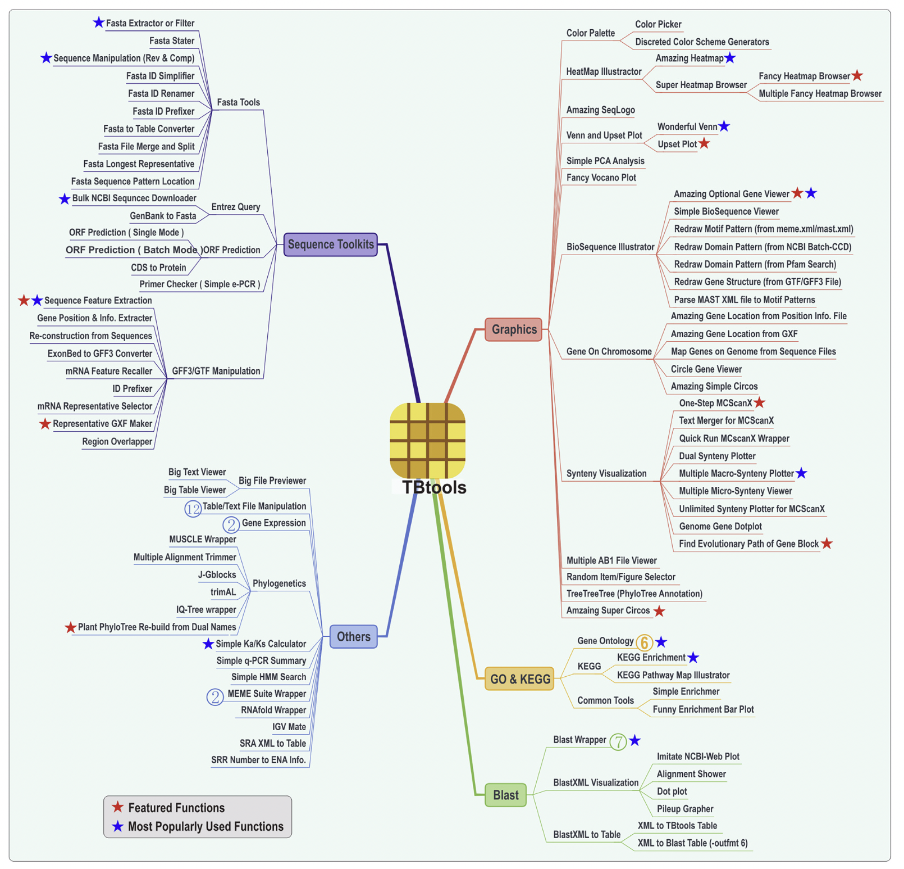
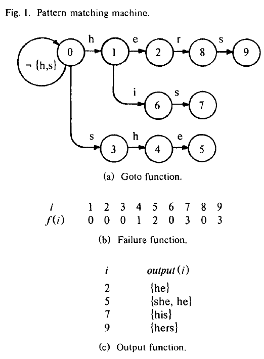
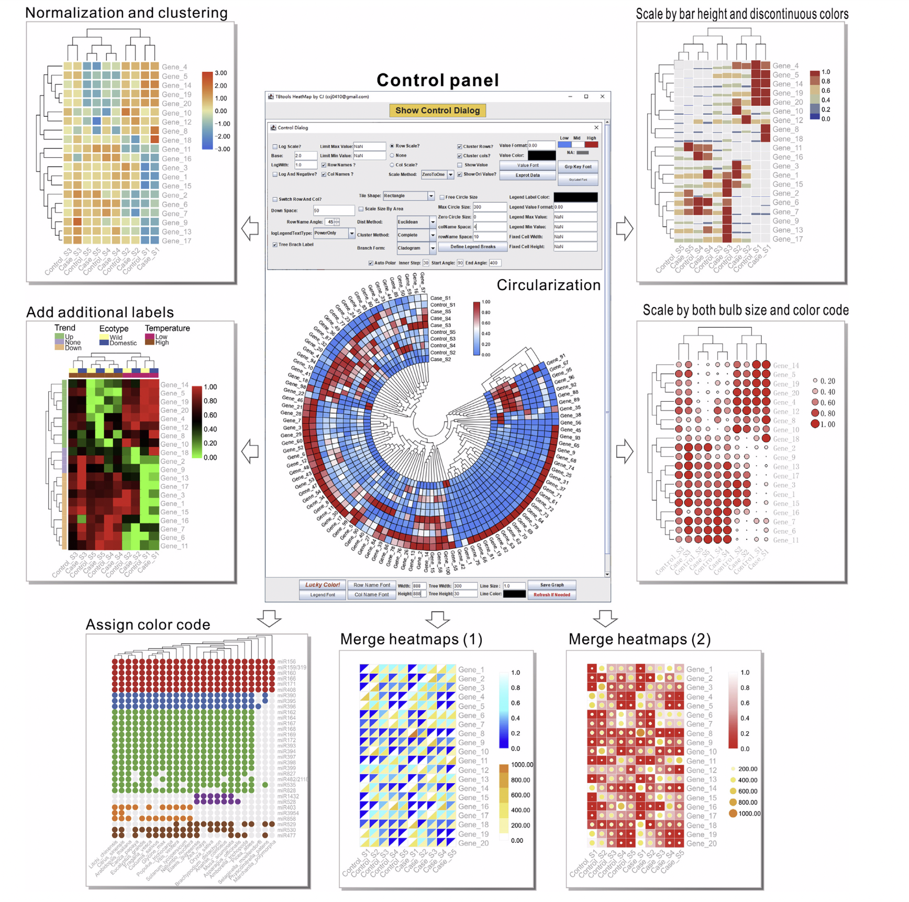
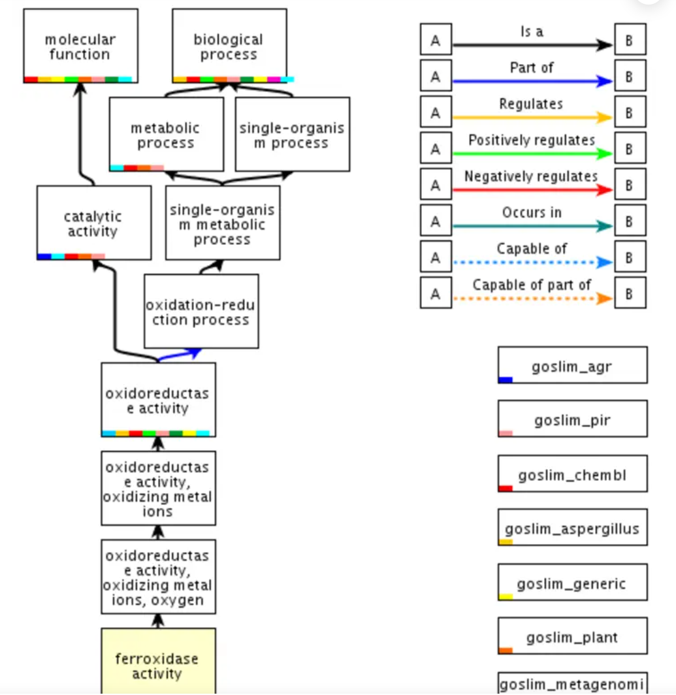
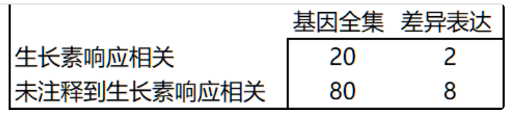
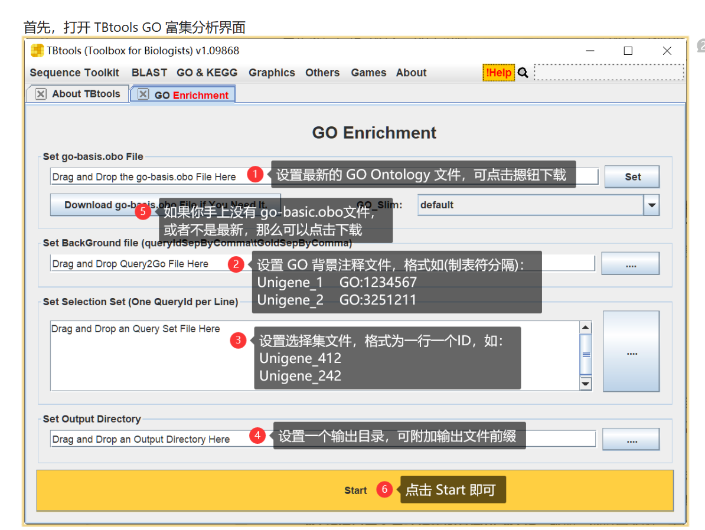
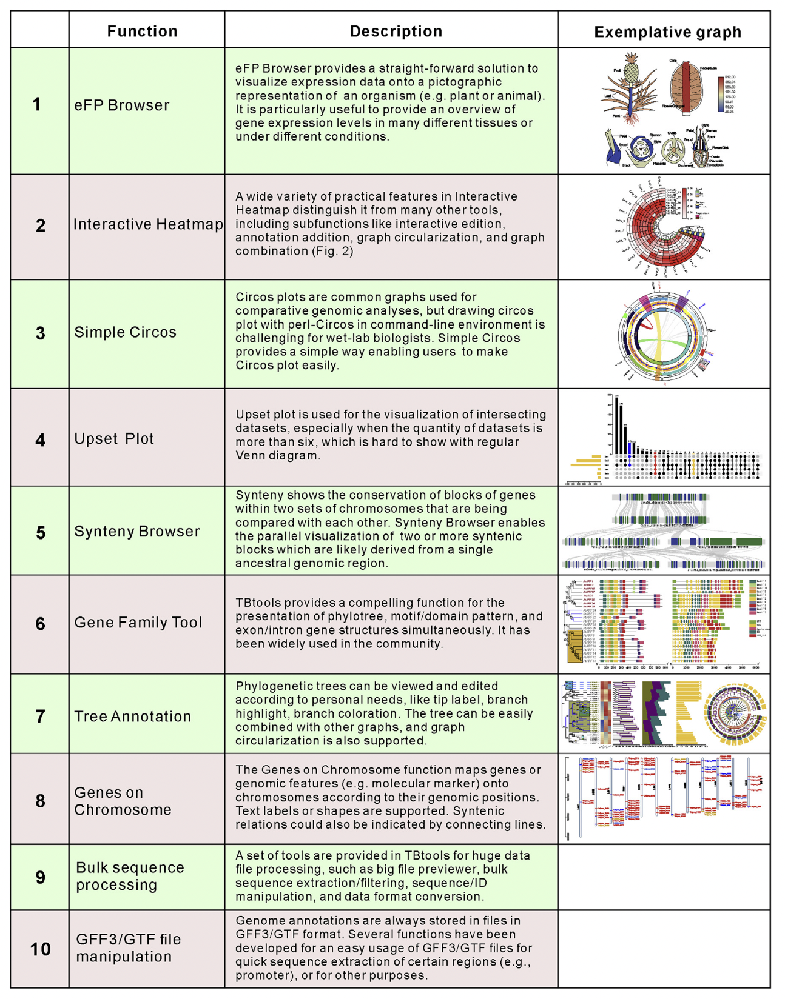
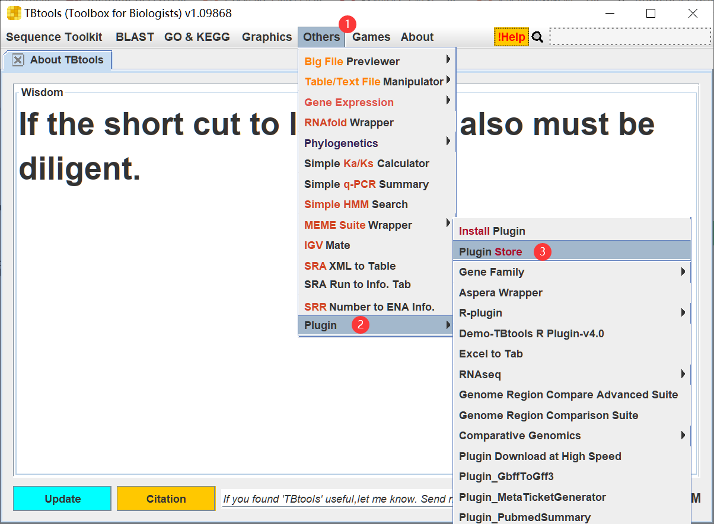
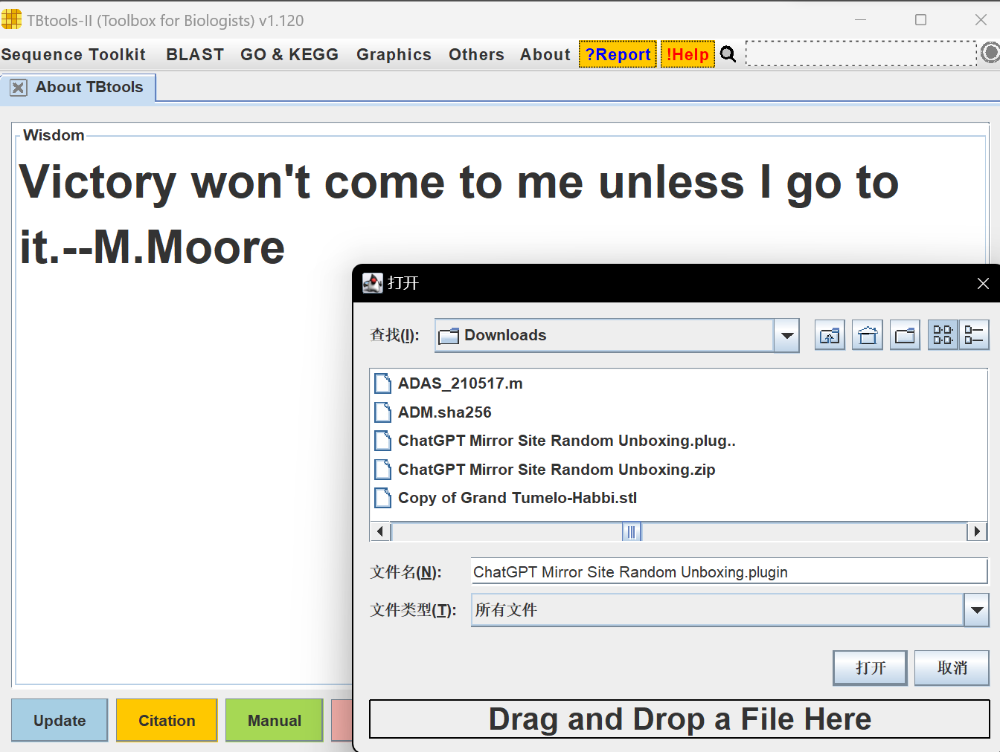
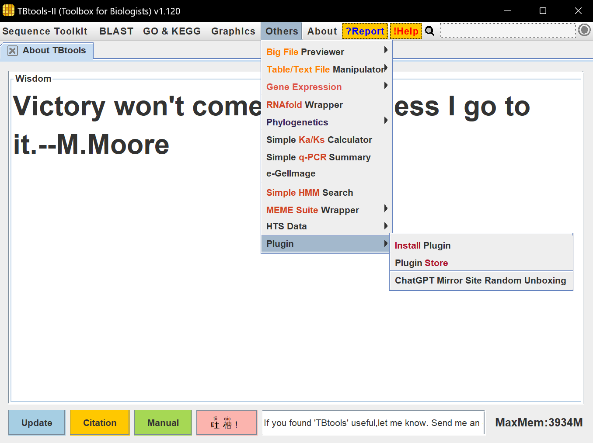

# “Linux 生物信息技术基础”总结报告 10

> 组：G04 次：10 组长：高大可 讨论记录：邓昆月 参与人员：高大可、邓昆月、唐明川、吴航锐 上课时地：2023 年 5 月 8 日，15:10-17:00，35 楼 B107A 讨论时地：2023 年 5 月 14 日，19:30-21:30，35 楼 B221

# 上课内容

## TBtools 软件安装使用

TBtools (a Toolkitfor Biologists integrating various biological data-handling tools)，是一款集成了 blast、KEGG 等模块的生信分析软件

> 下载地址：[https://github.com/CJ-Chen/TBtools/releases](https://github.com/CJ-Chen/TBtools/releases)

## TBtools 软件使用

> [https://www.yuque.com/cjchen/hirv8i](https://www.yuque.com/cjchen/hirv8i)

tbtools 的功能总览（130 余种）

应用实例：利用 TBtools 完成无门槛构建系统发育树的全套流程

> [https://zhuanlan.zhihu.com/p/614939369](https://zhuanlan.zhihu.com/p/614939369)

# <strong>讨论主题</strong>

1. ORF prediction
2. Tbtools 数据可视化
3. 基因富集分析
4. 最常用的一些功能简介
5. 插件安装和使用

# 讨论内容

## ORF prediction

### 背景

预测 ORF(Open Reading Frame)时，从 mRNA 角度（起始密码子，canonical 或 non-canonical 等），蛋白质角度（蛋白产物稳定性、是否具有功能等）进行预测。

### TBtools 中的 ORF prediction

可进行单条序列中 ORF 的预测

批量序列中 ORF 的预测

批量 CDS 对蛋白质的转化（是否考虑密码子偏好性）

### 常用的 ORF 预测软件——<strong>OrfM</strong>

以往寻找终止密码子的方式：将原始序列切成 6 种不同的 frame，逐个扫描获得终止密码子。

OrfM<strong>(</strong><strong>fast open reading frame predictor for metagenomic data</strong><strong>)</strong>直接在原始的核苷酸序列种寻找终止密码子，使用 Aho-Corasick 算法

Aho-Corasick：

A. 根据已有的数据建立有限的目标 pattern 和模式匹配机

B. 使用模式匹配机对文本字符串进行单遍处理。

构建模式匹配机所需的时间与 pattern 长度的总和成正比。

模式匹配机在处理文本字符串时进行状态转换的次数与关键字的数量无关。

> ### 参考资料 [https://zhuanlan.zhihu.com/p/144873860](https://zhuanlan.zhihu.com/p/144873860) [https://www.youtube.com/watch?v=O7_w001f58c](https://www.youtube.com/watch?v=O7_w001f58c)

## Tbtools 数据可视化

TBtools 是为交互式数据表示而开发的，而数据可视化和表示是生物信息分析不可或缺的部分。与通常生成不可编辑图形的常规图形生成器不同，TBtools 生成充满可编辑特征的交互图形。TBtools 中集成了一个名为“JIGplot”（Java 交互式图形）的新开发的绘图引擎，可以快速修改各种图形功能。

例如：可以在 control panel 上快速的调节绘画时的各种参数，修改生成的可视化图片，为用户提供了很大的方便性。

## 基因集合富集分析

- 在现在的组学研究中几乎离不开 GO 分析，那么 GO 是干什么的呢，GO 的诞生主要目的是来<strong>归类</strong>，统一生物学方言的（不同的生物学数据库可能会使用不同的术语），它是一个有向无环图（DAG）本体,主要形式是 term 标记，每个 GO term 代表一种功能描述，都属于 ontology，而 GO 总共分成三个 ontology:molecular function, cellular component 和 biological process；在 GO 中 GO term 之间存在多种关系，常见的主要是 is_a 和 part_of 和两种关系，is_a：表示包含关系，如图中黑色箭头，需要强调的是“完全包含”；Part_of：表示一部分，如图蓝色箭头部分，简单的来说是 A part_of_B 意味着如果 A 出现，那么它就肯定是 B 的一部分或组成部分，但 A 不一定总会出现。比如叶绿体 part_of 细胞，叶绿体肯定是细胞的一部分，但有的细胞没有叶绿体。

### 基本原理介绍

- 例如现在有一个基因集合（如差异表达基因集合或 ChIP-seq 的 Peaks 或 GWAS 定位的系列区间），以及有一个功能标签（例如如生长素信号转导相关 ）。假定该物种一共有 100 个基因，其中 20 个基因与生长素信号转导相关，80 个没有注释到与生长素信号转导相关（在该注释库下被认为于无关），我们做了对植株做了处理，和 CK 分别测定转录表达谱，通过差异表达分析，鉴定到 10 个差异表达基因，其中 2 个与生长素信号转导相关，而另外 8 个则没注释到生长素信号转导相关。结果如下：

- 检测结果中<strong>用于差异分析的基因集合</strong>中与生长素相应相关的基因比例与<strong>基因全集</strong>中与生长素相应相关的基因比例（背景比例相同），说明没有富集。
- 注意：

1. <strong>区别“富集”和“富集显著”</strong>：上述按理，若实验组基因集合中具有感兴趣标签的基因的比例超过背景比例，那么这种情况类比上，就是“富集”，因为偏离了背景。但是通过检验，如果偏离程度不大，则不能排除这是一种随机波动；而如果显著偏离了背景分布，就是“富集显著”。
2. 富集分析时，很多新接触的，搞错的往往就是没搞清楚原理，背景（基因全集） 和 实验组基因集合（基因选择集合）（如差异表达基因集合）。一定要注意，<strong>做基因功能富集分析是，背景注释指的是这个物种所有基因的功能注释信息而不是选择集的基因功能注释</strong>。比如，做拟南芥的，大概有 2w+ 个基因的功能注释，拿这个做背景；而不是拿差异表达的几百上千个基因的注释做背景。

### TBtools 实现 GO 富集分析

整体如上，一共三个文件：

1. go-basic.obo 文件，可以从 [http://purl.obolibrary.org/obo/go/go-basic.obo](http://purl.obolibrary.org/obo/go/go-basic.obo) 下载
2. 一个物种所有基因的 GO 注释文件
3. 一个基因选择集合，如实验组基因集合，如差异基因集合，或 GWAS 筛选出来的基因集合等

## 最常用的一些 TBtools 简介

（1）eFP Browser 能够提供一个很简单便捷的方法用来可视化基因在宏观结构上的表达情况

（2）interactive heatmap：提供基因互作关系的程度关系

（3）simple circos：一种常见的基因比较分析可视化方法

……

## TBtoos 插件安装

TBtools 的插件模式允许用户在 TBtools 核心功能外按照自己需要安装特定插件，从而使用对应功能。这些插件可以直接在 TBtools 的 插件商店中找到。

安装完成后重启软件即可看见插件。

# 存在问题
