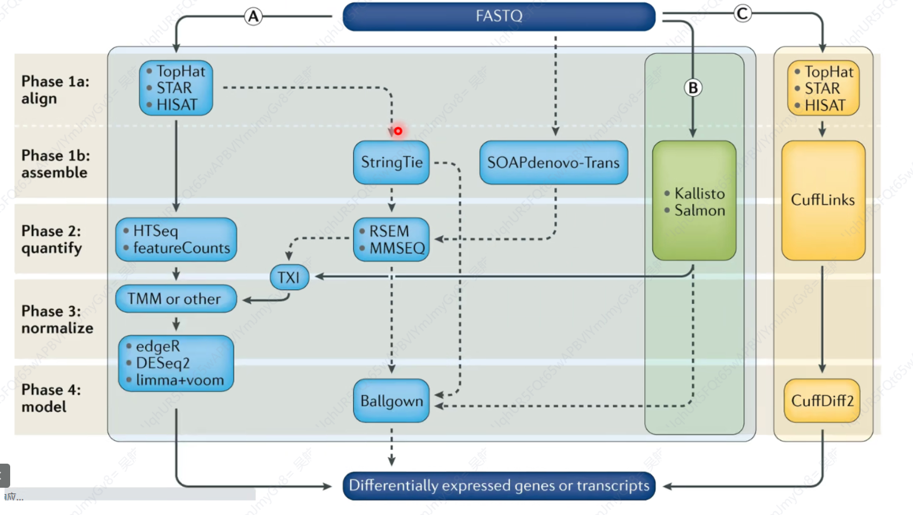
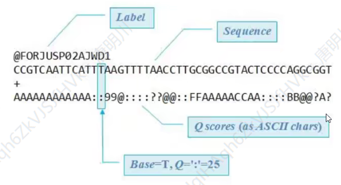
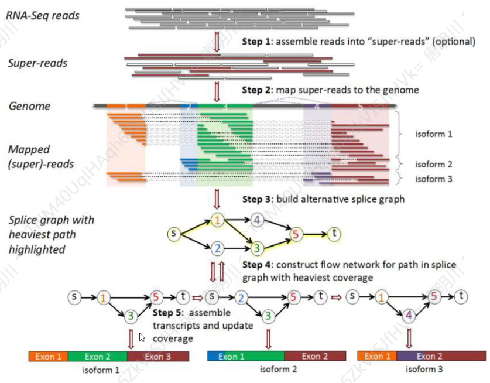
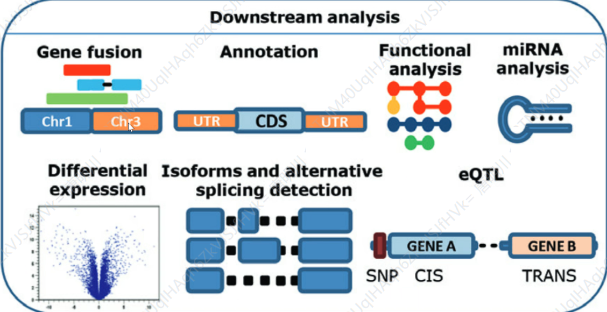
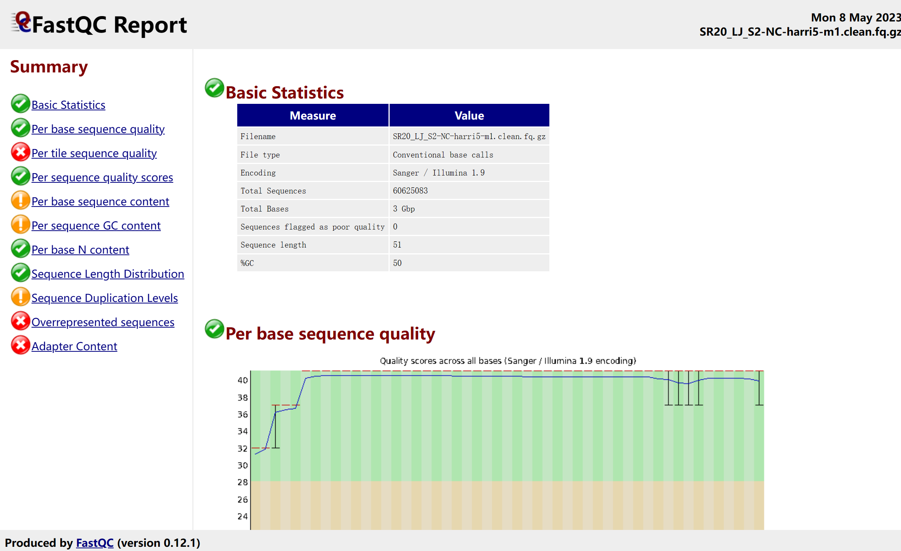

# “Linux 生物信息技术基础”总结报告 11

> 组：G04<br/>次：11<br/>组长：高大可<br/>讨论记录：唐明川<br/>参与人员：高大可、邓昆月、唐明川、吴航锐<br/>上课时地：2023 年 5 月 15 日，15:10-17:00，35 楼 B107A<br/>讨论时地：2023 年 5 月 21 日，19:00-21:00，35 楼 B221

# 上课内容

## 李扬：转录组数据分析 bulk RNA-seq

- 能做什么？

  - 多组学联合分析 - 结合单细胞转录组与 bulk 转录组更好地进行细胞分群
  - Sample variance？
  - ！！<strong>去寻找差异基因</strong>！！
- pipeline



> ### 参考资料<br/>#### Summary by Yang Li<br/>[https://zhuanlan.zhihu.com/p/532144076](https://zhuanlan.zhihu.com/p/532144076)<br/>#### Reviews<br/>[https://genomebiology.com/articles/10.1186/s13059-016-0881-8](https://genomebiology.com/articles/10.1186/s13059-016-0881-8)<br/>[https://www.nature.com/articles/s41576-019-0150-2](https://www.nature.com/articles/s41576-019-0150-2)<br/>#### Articles<br/>Y.Zhao et al. Cell Reports (2018)<br/>S. Sun et al. Proceedings of the National Academy of Sciences (2015)<br/>#### Nf-core<br/>[https://github.com/nf-core/rnaseq](https://github.com/nf-core/rnaseq)<br/>[https://www.nature.com/articles/s41587-020-0439-x](https://www.nature.com/articles/s41587-020-0439-x)<br/>#### Tutorials<br/>[https://www.azenta.com/blog/quick-start-guide-rna-seq-data-analysishttps:/bioinformatics.uconnedu/resources-and-events/tutorials-2/rna-seg-tutorial-with-reference-genome](https://www.azenta.com/blog/quick-start-guide-rna-seq-data-analysishttps:/bioinformatics.uconnedu/resources-and-events/tutorials-2/rna-seg-tutorial-with-reference-genome)

## 易鼎程&王沛宇：RNA-seq 基本流程

RNA 数据库：GEOdatabase(ncbi, many tissues besides human)、TCGA、SRA-EBIDDBJ

数据分析流程：序列质控、比对、转录本组装&表达量定量

### 质控



<em>数据 Fastq 文件</em>

查看测序质量：FastQC/MultiQC

去除低质量序列：Trimmomatic/cutadapt

去除接头序列 cutadapt

去除 rRNA 序列：bowtie2 --un-gz

### 比对

常用软件：STAR/HISAT2/Trinity

可视化结果：IGV

### 表达定量

HTSeq-seq：原始数量

Cufflinks-frag-bias-correct：同时实现重组装和定量，预测新转录本

StringTie：速度更快、更灵敏

Trinity：可用于组装



Htseq-count 默认参数计数时会去掉 MAPQ<10 的 read，也就是全部重复比对的 reads，可以通过-a 参数修改

### 下游分析

- 定量后得到表达矩阵，根据表达矩阵进行下游分析，常见的下游分析：



> ### 参考资料<br/>[RNA-Seq differential expression analysis: An extended review and a software tool ](https://doi.org/10.1371/journal.pone.0190152)[https://doi.org/10.1371/journal.pone.0190152](https://doi.org/10.1371/journal.pone.0190152)<br/>Stark, R., Grzelak, M. & Hadfield, J. RNA sequencing: the teenage years. Nat Rev Genet 20, 631–656 (2019). [https://doi.org/10.1038/s41576-019-0150-2](https://doi.org/10.1038/s41576-019-0150-2)<br/>Corchete, L.A., Rojas, E.A., Alonso-López, D. et al. Systematic comparison and assessment of RNA-seq procedures for gene expression quantitative analysis. Sci Rep 10, 19737 (2020). [https://doi.org/10.1038/s41598-020-76881-x](https://doi.org/10.1038/s41598-020-76881-x)

## 饶希晨：CHIP-seq、免疫共沉淀数据处理

CHIP-seq 目的：检测目标蛋白在基因组上的序列位置

### <strong>CHIP-seq 流程</strong>

- 原始测序数据的质控和过滤
- 测序数据回帖(或者称为比对，mapping)到基因组。比对文件的过滤、去重 (duplication)
- 寻找 Peak (Peak calling）

下游分析:

- Peak 的注释、motif 分析
- Peak 与其他转录因子、基因组区域以及组蛋白修饰的共定位 (co-peak)

### 理解并运用所学到的 Linux 操作方法

### 理解二代测序数据分析流程中的重要概念

### 掌握 ChIP-Seq 的分析流程与基本原理

> ### 参考资料<br/>孟浩巍，《高级生信系列课程: 表观遗传学数据分析》<br/>[https://zhuanlan.zhihu.com/p/522812688](https://zhuanlan.zhihu.com/p/522812688)<br/>[https://ke.qq.com/course/5409096#term_id=105591564](https://ke.qq.com/course/5409096#term_id=105591564)

# <strong>讨论主题</strong>

1. 实践从下载数据到下游分析的 RNAseq 分析过程
2. RNAseq 下游分析应用场景

# 讨论内容

## 实践从下载数据到下游分析的 RNAseq 分析过程

RNA-seq 的分析流程：

得到测序数据 -> 进行质控（进行数据质检） -> 去除双端接头 -> 对去接头的数据质检 -> 建立参考序列 -> 比对得到（sam）bam 文件 -> （对 bam 文件进行质检） -> （查 看比对结果） -> 获取基因表达矩阵 -> 进行下游基因差异表达的统计学分析

### fastq 数据查看

<strong>查看测序文件，统计文件的行数、read 数、测序长度信息</strong>

- 统计文件行数：

```
wc -l SRR1039508_1.subsample.fastq
```

- 查看文件：

```
less SRR1039508_1.subsample.fastq
```

- 一个 read 有四行:
- 第一行：以‘@’开头，后面是 read 的属性信息，即 read 的名称。中间不会有空格，用冒号隔开。HWI-STI77 是测序平台的名字，290 为测序的编号，C0TECACXX 为流通池（flowcell）的编号；1 表示流通池的第一个 lane，2208 表示第一个 lane 中第 11101 个 tile，18736 和 181153 表示该 read 在该 tile 中的 x,y 坐标信息。它是每一条 read 的唯一标识符，同一份 FASTQ 文件中不会重复出现，甚至不同的 FASTQ 文件里也不会有重复
- 第二行：测序 read 的序列，由 A，C，G，T 和 N 这五种字母构成，是真正需要关心的 DNA 序列，N 代表的是测序时那些无法被识别出来的碱基
- 第三行：以‘+’开头，后面可以跟随该 read 的名称（名称可以省略）
- 第四行：测序 read 的质量值，和第二行的碱基信息一样重要，描述的是每个测序碱基的可靠程度，用 ASCII 码表示。每个碱基对应的字符在 ASCII 码中对应的十进制数字减 33/64 即为该碱基的质量（即 Phred33/64 体系）。比如第一个字符为 H，其对应的 ASCII 码为 72，则其质量为 39。。碱基质量$Q=-10*lgP$，$P$为碱基被测错的概率，即 Q=30 表示碱基被测错的概率为 0.001。碱基质量越高，被测错的概率越低。Q30 表示原始数据中 Phred 值大于 30 的碱基数量占总碱基数量的百分比，Illumina 官方保证大于 80% 碱基准确度达 Q30。 一共有 20000 条 reads 数，每条 read 的测序长度为 63

### 质量评估

<strong>用 FastQC 或 MultiQC，对测序数据进行质量评估</strong>

#### fastqc 基本格式

```
fastqc [-o output dir] [--(no)extract] [-f fastq|bam|sam] [-c contaminant file] seqfile1 .. seqfileN
#主要是包括前面的各种选项和最后面的可以加入N 个文件
-o --outdir FastQC 生成的报告文件的储存路径，生成的报告的文件名是根据输入来定的
--extract 生成的报告默认会打包成1个压缩文件，使用这个参数是让程序不打包
-t --threads 选择程序运行的线程数，每个线程会占用250MB 内存，越多越快咯
-c --contaminants 污染物选项，输入的是一个文件，格式是Name [Tab]Sequence，里面是可能的污染序列，如果有这个选项，FastQC 会在计算时候评估污染的情况，并在统计的时候进行分析，一般用不到
-a --adapters 也是输入一个文件，文件的格式Name [Tab] Sequence，储存的是测序的adpater 序列信息，如果不输入，目前版本的FastQC 就按照通用引物来评估序列时候有adapter 的残留
-q --quiet 安静运行模式，一般不选这个选项的时候，程序会实时报告运行的状况。
```

#### 进行 fastqc 质检

```
mkdir fastqc
for fq in ./fastq/*.*; do fastqc --noextract -q -o ./fastqc $fq; done
```

#### 文本解读

- 绿色“勾”表示合格，黄色“感叹号”表示警示，红色“×”表示不合格 得到如图所示结果



> 1. Basic Statistics <br/>1. Per base sequence quality <br/>1. Per tile sequence quality <br/>1. Per sequence quality scores <br/>1. Per base sequence content <br/>1. Per sequence GC content <br/>1. Per base N content <br/>1. Sequence Length Distribution 统计 reads 长度的分布<br/>1. Sequencing Duplication Levels <br/>1. overrepresented sequences <br/>1. Adapter content

- Encoding：测序平台的版本和相应的编码版本号
- Total Sequences:输入文本的 reads 数目
- Sequence length:测序的长度
- %GC：整体序列的 GC 含量，这个值一般是物种特异性的（人类细胞中 GC 含量在 42% 左右）
- 横坐标是测序序列的第一个碱基到最后一个碱基（等于序列长度）
- 纵坐标是质量得分。$Q = -10*log10 (error P)$ 即 20 表示 1% 的错误率，30 表示 0.1% 的错误率
- 图中每一个 boxplot 都是该位置的所有序列的测序质量的统计。红线是中位数，蓝线是平均数曲线，黄箱上边缘是 75% 分位数，下边缘是 25% 分位数，延伸线上面的 bar 是 90% 分位数，下面的 bar 是 10% 分位数。一般要求 10% 分位数大于 20（Q20 过滤）。
- 只有在分析 illumina 测序结果且保留了序列 ID 信息时才有该部分结果，结果展示每个 tile 在每个碱基位置上偏离偏离该位置所有 tiles 平均质量的情况。
- 图中横轴代表碱基位置，纵轴代表 tile 的 Index 编号。图中的颜色是从冷色调到暖色调的渐变，冷色调表示这个 tile 在这个位置上的质量值高于所有 tile 在这个位置上的平均质量值，暖色调表示这个 tile 的在这个位置上的质量值比其它 tiles 要差；一个很好的结果，整张图都应该是蓝色
- 如果某 tile 的测序质量很低，可以考虑去除该 tile 的序列数据。
- Warning 报警：如果任何 tile 的平均质量值与这个位置上所有 tiles 的平均质量值相差 2 以上
- Failure 报错：如果任何 tile 的平均质量值与这个位置上所有 tiles 的平均质量值相差 5 以上
- 反映序列得分的分布情况
- 横轴为每个 read 的测序质量平均值（一条序列质量的平均值为每个碱基位置上 Q 的均值）
- 纵轴为 read 的数量
- Warning 报警：最高峰（最大分布的 reads）质量值小于 27（错误率 0.2%）
- failure 报警：最高峰质量值小于 20（错误率 1%）
- 统计每个位置各碱基的比例
- 横轴代表碱基位置。纵轴代表各碱基在该位置上的百分比。
- 正常情况下四种碱基的出现频率应该是大致相同，因此好的样本中四条线应该平行且接近。当部分位置碱基的比例出现 bias 时，即四条线在某些位置纷乱交织，往往提示我们有 overrepresented sequence 的污染。当所有位置的碱基比例一致的表现出 bias 时，即四条线平行但分开，往往代表文库有 bias (建库过程或本身特点)，或者是测序中的系统误差。在 reads 开头出现碱基组成偏离往往是我们的建库操作造成的，比如建 GBS 文库时在 reads 开头加了 barcode；barcode 的碱基组成不是均一的，酶切位点的碱基组成是固定不变的，这样会造成明显的碱基组成偏离。在 reads 结尾出现的碱基组成偏离，往往是测序接头的污染造成的。
- warning：当任一位置的 A/T 比例与 G/C 比例相差超过 10%
- failure：当任一位置的 A/T 比例与 G/C 比例相差超过 20%
- ??overrepresented sequence 的污染是啥？？
- 统计 reads 的平均 GC 含量的分布
- 横轴为 GC 比例，纵轴为 reads 数量。
- 红线是实际情况，蓝线是理论分布（由于软件并不知道所测物种真实的 GC 含量，图中的理论分布是基于所测数据计算得来的）。
- 在一个正常的随机文库中，GC 含量的分布应接近正态分布，且中心的峰值和所测基因组的 GC 含量一致。曲线形状的偏差（比如有不正常的尖峰）往往是由于文库的污染（可能混入其他物种）或是部分 reads 构成的子集有偏差（overrepresented reads）。形状接近正态但偏离理论分布的情况提示我们可能有系统偏差。
- warning:偏离理论分布的 reads 超过 15%
- failure:偏离理论分布的 reads 超过 30%
- 当测序仪器不能辨别某条 read 的某个位置到底是什么碱基时，就会产生“N”
- 对所有 reads 的每个位置，统计 N 的比例。正常情况下 N 的比例是很小的，所以图上常常看到一条直线，但放大 Y 轴之后会发现还是有 N 的存在，这不算问题。
- 当 Y 轴在 0%-100% 的范围内也能看到“凸起”时，说明测序系统出了问题。
- 出现一定比例的 Ns 最常见的原因是普遍出现的质量丢失(a general loss of quality)，这种情况可结合其它部分的结果来综合判断；另一种常见的现象是文库整体上的测序质量较高，但 reads 开头出现较高比例的 N，这可能是由于文库的碱基组成偏离的比较严重，测序仪不能给出正确的 call，这种情况可以结合 per base sequence content 的结果来判断
- warning：当任意位置的 N 的比例超过 5%
- failure：当任意位置的 N 的比例超过 20%
- 横轴为片段长度，纵轴为 read 数量
- 测序仪出来的原始 reads 通常是均一长度的，但经过质控软件等处理过的数据则可能长度不同
- 如果测序出的长度不同很严重，则表明测序仪在此次测序过程中产生的数据不可信
- warning：当 reads 长度不一致
- failure：当有长度为 0 的 read
- 序列重复度分布图将会展示文库中不同重复度的序列所占比例
- 如果原始数据很大（事实往往如此），对所有序列的比较将会需要很大内存，所以 FastQC 只用前 100,000 条 reads 来进行统计，以反映全部数据中序列重复度情况。而且，大于 75 bp 的 reads 只取前 50 bp 进行比较，由于 reads 越长越不容易完全相同（由测序错误导致），所以这样做使得重复度的统计更加严格
- 横轴表示重复水平（重复数目），纵轴是重复 reads 的比例。
- 蓝色线展示了全部序列中不同重复度序列的百分比，红线显示的是有重复序列中不同重复度序列的百分比（所有序列的重复度减去 1）
- 统计序列的重复度（duplication level，即一个文库中某条序列的 copy 数），理论上大部分序列都只出现一次，低的重复度意味着高的基因组覆盖率。测序深度越高，越容易产生一定程度的重复，这是正常的现象；但如果 duplication 的程度很高，就提示我们可能有 bias 的存在（如建库过程中的 PCR duplication）。
- warning：当非 unique（也即 duplication level 大于 1）的 reads 占总数的比例大于 20%
- failure：非 unique 的 reads 占总数的比例大于 50%
- 如果有某个序列大量出现，就叫做 over-represented
- FastQC 的标准是占全部 reads 的 0.1% 以上。和上面的 duplicate analysis 一样，为了计算方便，只取了 fastq 数据的前 100,000 条 reads 进行统计，且大于 75 bp 的 reads 也是只取 50 bp，所以有可能 overrepresented reads 不全在里面。
- warning:某 read(s)超过总 reads 数 0.1%
- failure:某 read(s)超过总 reads 数 1%
- 统计接头序列的含量。一般测序仪自带软件会切去接头序列，所以下机数据并没有接头序列
- 如果在当时 fastqc 分析的时候-a 选项没有内容，则默认使用通用 adapter 序列进行统计。如果有 adapter 序列没有去除干净的情况，在后续分析的时候需要先使用 cutadapt 软件进行去接头
- <u>进行 multiqc 质检</u>

```
# cd到生成fastqc文件的目录中
cd ~/wuhangrui/lectest/homework2_1006/fastqc

# 对内部所有fastqc文件进行multiqc整合(也可直接指定分析文件的路径)
multiqc .
```

### 数据过滤

<strong>使用 trimmomatic 过滤</strong>

#### 运行语句

```powershell
trimmomatic PE
[-threads <threads]
[-phred33 | -phred64]
[-trimlog <logFile>]
[-basein <inputBase> | <input 1> <input 2>]
[-baseout <outputBase> | <paired output 1> <unpaired output 1> <paired output 2> <unpaired output 2>]
<step 1> <step 2> ...
```

#### 实际代码

```powershell
cd ~/lectest/homwork2/fastq

vim trimmomatic.sh

# 在fastq下建立trim的结果文件夹
mkdir trim

# 循环遍历fastq中的fastq文件，并进行trim筛选
for i in $(ls *_1*.fastq)
do
i=${i/_1*.fastq/} #将_1*.fastq部分从i中去除掉
trimmomatic PE -phred33 -threads 20 \ #设置双端测序，格式，启用线程数
./${i}_1.subsample.fastq ./${i}_2.subsample.fastq \ # 输入文件
./trim/${i}_1.clean.fastq ./trim/${i}_1.unpaired.fastq ./trim/${i}_2.clean.fastq ./trim/${i}_2.unpaired.fastq \ # 输出文件
# ILLUMINACLIP:TruSeq2-PE.fa:2:30:10 \ # 去掉接头序列
LEADING:3 TRAILING:3 MINLEN:35 HEADCROP:8 \ # 筛选参数
1>./trim/${i}.trim.log 2>&1 & #将运行过程传输至日志，且在后台运行
done

bash trimmomatic.sh
```

> #### 参数说明

- -trimlog 参数指定了过滤日志文件名，日志中包含以下四列内容：read ID，过滤之后剩余序列长度，过滤之后的序列起始碱基位置（序列开头处被切掉了多少个碱基），过滤之后的序列末端碱基位置，序列末端处被剪切掉的碱基数。由于生成的 trimlog 文件中包含了每一条 reads 的处理记录，因此文件体积巨大（GB 级别），如果后面不会用到 trim 日志，建议不要使用这个参数。
- [-phred33 | -phred64] 参数指定 fastq 的质量值编码格式，如果不设置这个参数，软件会自动判断输入文件是哪种格式
- [-basein | <input 1> <input 2>] 在 PE 模式下，有两个输入文件，正向测序序列和反向测序序列。通常 PE 测序的两个文件，R1 和 R2 的文件名是类似的，因此可以使用-basein 参数指定其中 R1 文件名即可，软件会推测出 R2 的文件名，但是这个功能实测并不好用，建议单独输入 R1 和 R2 的文件名。
- [-baseout | <paired output 1> <unpaired output 1> <paired output 2> <unpaired output 2>] 在 PE 模式下，过滤之后输出文件有四个，过滤之后双端序列都保留的就是 paired，如果其中一端序列过滤之后被丢弃了另一端序列保留下来了就是 unpaired 。输出文件有四个，使用-baseout 参数指定输出文件的 basename，软件会自动为四个输出文件命名。
- -threads 线程数，最大是 CPU 核数
- -quiet 静默模式
- Trimmomatic 过滤数据的步骤与命令行中过滤参数的顺序有关。
- ILLUMINACLIP：过滤 reads 中的 Illumina 测序接头和引物序列，并决定是否去除反向互补的 R1/R2 中的 R2。如果需要去接头，建议第一步就去接头，否则接头序列被其他的过滤参数剪切掉部分之后就更难匹配更难去除干净了。去除接头以及引物序列看似简单，但需要权衡灵敏度（保证接头和引物去除干净）和特异性（保证不是接头和引物的序列不被误切除），由于测序中可能存在的随机错误让去接头这样一个简单的操作变的复杂。具体参数用冒号隔开，具体参数列表略(详见 bulk 文件)。
- SLIDINGWINDOW:从 reads 的 5' 端开始，进行滑窗质量过滤，切掉碱基质量平均值低于阈值的滑窗。

  - SLIDINGWINDOW:<windowSize>:<requiredQuality>
  - windowSize:设置窗口大小
  - requiredQuality：设置窗口碱基平均质量阈值
- MAXINFO

  - 一个自动调整的过滤选项，在保证 reads 长度的情况下尽量降低测序错误率，最大化 reads 的使用价值。
  - MAXINFO:<targetLength>:<strictness>
  - targetLength：使得 reads 可以 map 到参考序列上唯一位置的最短长度,通常最短 reads 要求不低于 40 bp。过短的序列往往能 map 到参考基因组上的多个位置（特异性差）。影响 INFO 分值的控制因素一。
  - strictness：一个介于 0 - 1 之间的小数，决定如何平衡最大化 reads 长度 或者最小化 reads 出现错误的概率，当参数设置小于 0.2 时倾向于最大化 reads 长度，当参数设置大于 0.8 时倾向于最小化 reads 中出现测序错误的概率。影响 INFO 分值的平衡因素二和三。
- LEADING

  - 从 reads 的开头切除质量值低于阈值的碱基。
  - LEADING:<quality>
  - quality：设定碱基质量值阈值，低于这个阈值将被切除。
- TRAILING

  - 从 reads 的末尾开始切除质量值低于阈值的碱基。
  - 从 reads 的末端开始切除质量值低于设定阈值的碱基，直到有一个碱基质量值达到阈值。Illumina 平台有些低质量的碱基质量值被标记为 2 ，所以设置为 3 可以过滤掉这部分低质量碱基。官方推荐使用 Sliding Window 或 MaxInfo 来代替 LEADING 和 TAILING。
  - TRAILING:<quality>
  - quality：设定碱基质量值阈值，低于这个阈值将被切除。
- CROP

  - 从 read 的末尾切掉部分碱基使得 reads 达到指定长度。
  - 不管碱基质量，从 reads 的起始开始保留设定长度的碱基，其余全部切除。一刀切，把所有 reads 切成相同的长度。
  - CROP:<length>
  - length：reads 从末端除之后保留下来的序列长度
- HEADCROP

  - 从 reads 的开头切掉指定数量的碱基（不管碱基质量如何）。
  - HEADCROP:<length>
  - length：从 reads 的起始开始切除的碱基数。
- MINLEN

  - 如果经过剪切后 reads 的长度低于阈值则丢弃这条 reads。
  - MINLEN:<length>
  - length：可被保留的最短 read 长度。
- AVGQUAL：如果 reads 的平均碱基质量值低于阈值则丢弃这条 reads。
- TOPHRED33：将 reads 的碱基质量值体系转为 phred-33。
- TOPHRED64：将 reads 的碱基质量值体系转为 phred-64。

### 比对

<strong>从 GENCODE 下载人类最新版本的参考基因组序列和 gtf 注释文件，使用 STAR 构建参考基因组索引，并将测序数据（fastq 文件）比对到参考基因组上</strong>

1. 在 Gencode 下载相应的数据

> 注：Esemble 数据库和 Gencode 数据库对 RNA 的标记不同，若从不同数据库下载信息，需在后续过程注意。

1. 将数据储存在特定文件夹并解压

```powershell
# 将文件储存在如下目录中
mkdir ~/project/RNA-Seq/reference/hg38
# 解压
gunzip *.gz
```

1. 使用 STAR 构建基因组索引

```
cd ~/project/RNA-Seq/reference
mkdir star_index
cd star_index
mkdir hg38_chr21
cd ../../

vim star_index_chr21.sh

STAR \
#线程数
--runThreadN 40 \
#建立索引命令
--runMode genomeGenerate \
#建立索引的保存路径
--genomeDir ~/project/RNA-Seq/reference/star_index/hg38_chr21 \
#参考基因组的路径
--genomeFastaFiles ~/project/RNA-Seq/reference/hg38/chr21.fa \
#GTF文件路径，要和参考基因组同版本
--sjdbGTFfile ~/project/RNA-Seq/reference/hg38/chr21.gtf \
#这个值为测序read的长度减1，是在注释可变剪切序列的时候使用的最大长度值
--sjdbOverhang 62 \

cd star_index
bash star_index_chr21.sh
```

建立的索引的保存路径在命令中的参数中已经展示

1. 使用 STAR 进行 reads 比对（模式生物，大部分使用默认参数）仅对 trimmomatic 筛选之后的 paired 数据进行了比对

```powershell
cd ~/lectest/homework2_1006
mkdir star_read

cd ~/project/RNA-Seq/reference

vim star_read.sh

# 在储存筛选后的fastq文件夹内，遍历筛选后的（结尾为_1.clean.fastq）文件
for i in $(ls ~/lectest/homework2_1006/fastq/trim/*_1.clean.fastq)
do
# 将形式参数i设定为表示除去文件后半段(_1.clean.fastq）的字符串
i=${i/_1.clean.fastq/}
# 使用STAR进行比对
STAR \
--twopassMode Basic \ #使用two-pass模式进行比对
--runThreadN 12 \ #设置使用的线程数
--genomeDir ~/project/RNA-Seq/reference/star_index/hg38 \ #索引文件的目录
--outSAMtype BAM SortedByCoordinate \ #输出BAM文件并进行排序
--sjdbOverhang 149 \ #最长reads长度减1
--readFilesIn ${i}_1.clean.fastq ${i}_2.clean.fastq \ #输入文件
--outFileNamePrefix ~/lectest/homework2_1006/star_read/${i} \
--sjdbGTFfile ~/project/RNA-seq/reference/hg38/gencode.v41. annotation.gtf #gtf文件

cd ~/lectest/homework2_1006/star_read
bash ~/project/RNA-Seq/reference/star_read.sh
```

得到的 BAM 文件可直接使用 samtools view 进行查看，并拉去到本地，在 R 中进行表达矩阵的创建。

(将得到的 bam 比对文件拉取到本地，以下部分在 R 中进行)

### 表达矩阵

<strong>将 bam 文件中的序列信息转换成表达矩阵</strong>

1. 提取表达矩阵 -- 新建一个 R script,命名为 CountsToTpm

```r
geted() #查看工作目录

#load packages
library("DESeq2")
library("tximeta")
library("GEOquery")
library("GenomicFeatures")
library("BiocParallel")
library("GenomicAlignments")
library("dplyr")

#generate bam list
sample_name = readLines("../../SRR_Acc_List.txt")
dir = "../bam" #我的bam文件夹在工作文件夹上上一级
fls = file.path(dir,paste0(sample_name,".bam")) #字符串处理
file.exists(fls) #验证文件是否存在
bamlist = BamFileList(fls,yieldSize = 2000000) #构建bamlist

#generate features
txdb = makeTxDbFromGFF("../../chr21.gtf") #用txdb包读入基因组的注释文件
exonsByGene = exonsBy(txdb,by="gene")

#Generate SE object
register(SnowParam(workers = 16)) # 线程数
SE = summarizeOverlaps(features = exonsByGene,reads = bamlist, mode = "Union", singleEnd = F, ignore.strand = T) # 构建SE对象

#add coldata
colnames(SE) = sub(colnames(SE),pattern = ".bam", replacement='')

#save data --储存重要的中间文件
saveRDS(SE,file="./SE.rds")

##提取表达矩阵
express_matrix = assay(SE)

#部分counts表达矩阵展示
head(express_matrix)
                   SRR1039508 SRR1039509 SRR1039512 SRR1039513
ENSG00000141956.14          3          1          4          5
ENSG00000141959.17         25         21         29         26
ENSG00000142149.9           0          2          1          1
ENSG00000142156.16        593        547        663        515
ENSG00000142166.14         28         26         18         28
ENSG00000142168.15         23         18         33         23


##将counts表达矩阵导出
write.csv(express_matrix,"../count_matrix.csv")
```

1. 实现表达矩阵的 counts 和 TPM(Transcript per million)的转化 (归一化)

```r
###将表达矩阵的行名由(ensembl)转化为(symbol)

#导入注释文件并将其转化为dataframe格式
human_anno_chr21 = rtracklayer::import("../../chr21.gtf")
human_anno_chr21 = rtracklayer::as.data.frame(human_anno_chr21)

#获取id_name(ensembl)和gene_name(symbol)的对应关系并转化为data.frame
id_name = human_anno_chr21[,c("gene_id","gene_name")]
id_name = unique(id_name)
rownames(id_name) = id_name$gene_id #修改行名

#将id_name按照express_matrix的gene顺序排序
id_name = id_name[rownames(express_matrix),]
id_name = id_name[,2]

#将表达矩阵的行名由gene_id(ensembl)更改为gene_name(symbol)
express_matrix_genename = express_matrix
rownames(express_matrix_genename) = id_name

###将counts表达矩阵归一化得到Tpm

##获取基因长度（全外显子长度）
exons_gene_lens = lapply(exonsByGene, function(x){sum(width(reduce(x)))})
#将外显子长度转化为data.frame
gene_length = sapply(exons_gene_lens,function(x){x})
id_length = as.data.frame(gene_length)


##进行归一化得到Tpm表达矩阵
kb = id_length$gene_length / 1000
rpk = express_matrix_genename / kb

#Tpm caculation1--利用tpm定义进行计算
calcu_tpm1 = function(rpkdata){
  rpk = as.data.frame(rpkdata)
  tpm_tem = rpk %>%
    mutate_if(is.numeric, funs(./sum(.)))
  tpm = tpm_tem*1000000
  # tpm = log(tpm)
  return(tpm)
}

#Tpm caculation2 --利用Tpm定义进行计算
calcu_tpm2 = function(data){
  data = as.data.frame(data)
  total_data = data %>%
    summarise_all(sum)
  for(i in 1:ncol(data)){
    data[,i] = (data[,i])/total_data[,i]*1e6
  }
  # data <- log(data)
  return(data)
}

#获取两种计算方法的tpm表达矩阵
tpm1 = calcu_tpm1(rpk)
tpm2 = calcu_tpm2(rpk)

#部分tpm表达矩阵展示
head(tpm1)
head(tpm2)
        SRR1039508  SRR1039509  SRR1039512  SRR1039513
PRDM15    36.06015    13.64329    64.96016    85.55138
PFKL     437.58854   417.21330   685.81143   647.81354
HUNK       0.00000    41.29364    24.57655    25.89351
COL6A1 16735.60519 17522.13331 25280.23191 20689.24802
IFNAR1   308.92063   325.59308   268.31329   439.74172
SOD1    1819.46433  1616.22247  3527.04050  2589.96738


##将TPM表达矩阵导出
write.csv(tpm1, "../tpm_matrix.csv")
```

### RNAseq 下游分析应用场景——差异表达

<strong>分析 </strong><strong>control</strong><strong> 组和 treat 组的差异表达基因，并画 treat 组最显著高表达、 低表达的各 20 个基因的表达热图</strong>

`analysis.R`

```r
## 差异分析 -- 构建差异分析所需要使用的矩阵

# 导入差异分析及绘图需要使用的包
library("DESeq2")
library("dplyr")
library("pheatmat")

# load data
control_treat.data = read.table("../../homework2_1006/control_treat.count.txt", header = T, row.names = 1)

# 构建分组信息
condition = factor(c(rep("CONTROL",3),rep("TREAT",3)))
coldata = data.frame(row.names = colnames(control_treat.data),condition)
coldata #检查分组信息是否和真实数据一致
          condition
control.1   CONTROL
control.2   CONTROL
control.3   CONTROL
treat.1       TREAT
treat.2       TREAT
treat.3       TREAT

#构建dds矩阵
#利用control_treat.count文件（即对象control_treat.data）和分组信息（即对象coldata）构建
dds = DESeqDataSetFromMatrix(countData = control_treat.data,
                             colData = coldata,
                             design = ~condition)

#数据清洗，过滤在所有重复样本中小于1的基因(低质量数据过滤)
dds = dds[rowSums(counts(dds))>1,]

#PCA查看样本间的差异
dds_rld = rlog(dds)
plotPCA(dds_rld, intgroup = "condition")
```

```r
### 差异表达分析

#提取差异分析的结果
> dds = DESeq(dds) #将数据标准化（DESeq归一化方法）
resultsNames(dds) #查看结果名称
[1] "Intercept"                  "condition_TREAT_vs_CONTROL"
> dds$condition #默认后者的处理组比前面的对照组
[1] CONTROL CONTROL CONTROL TREAT   TREAT   TREAT
Levels: CONTROL TREAT
> res = results(dds)
> summary(res) #查看实验对照找到的差异基因分布的情况
out of 29871 with nonzero total read count
adjusted p-value < 0.1
LFC > 0 (up)       : 1304, 4.4%
LFC < 0 (down)     : 1543, 5.2%
outliers [1]       : 124, 0.42%
low counts [2]     : 12162, 41%
(mean count < 3)
[1] see 'cooksCutoff' argument of ?results
[2] see 'independentFiltering' argument of ?results

> table(res$padj < 0.05) # 矫正后的P值,看看有多少差异基因满足所设的P值要求
FALSE  TRUE
15452  2133
> res = res[order(res$padj),] # 按照pagj的升值排序
> resdata = merge(as.data.frame(res), as.data.frame(counts(dds,normalized=TRUE)), by="row.names",sort=FALSE)
> write.csv(resdata,file = "../control_treat_dseq.csv")

#筛选出符合自己要求的（比较有意义的）差异基因
> diff_gene_deseq2 <- subset(res, padj < 0.05 & abs(log2FoldChange) > 1)
#生成的差异性结果分析文件
> write.csv(diff_gene_deseq2,file = "../diff_gene.csv")
# 基因上调与下调的数目 并提取显著性差异的基因
> upregulate = subset(res, padj < 0.05 & log2FoldChange > 1)
> dim(upregulate)
[1] 933   6
> downregulate = subset(res, padj < 0.05 & log2FoldChange < -1)
> dim(downregulate)
[1] 1200    6
> write.csv(upregulate, "../up_gene.csv")
> write.csv(downregulate, "../down_gene.csv")
```

```r
### 差异表达可视化
> counts.norm.data = resdata[,-2:-7]
> # 将行名改为基因名
> rownames(counts.norm.data) = counts.norm.data[,1]
> counts.norm.data = counts.norm.data[,-1]
> head(counts.norm.data)
                control.1 control.2  control.3  treat.1  treat.2   treat.3
ENSG00000142748 1693.2764  855.4100   958.1660 2.712704 1.587401  3.412861
ENSG00000160868 1214.6700 9752.6692 19305.5129 9.946581 3.174802  5.119292
ENSG00000140505 1758.1908 3319.6872  3590.9348 9.042346 0.000000 11.091799
ENSG00000163687  668.9487  492.3581   487.8334 7.233877 3.174802  4.266077
ENSG00000170509  410.3912 1539.2407  1206.4578 1.808469 5.555904  5.972507
ENSG00000145708  632.6406  466.2482   446.2691 3.616938 0.000000  2.559646

# 在原矩阵中寻找差异表达基因，原表达矩阵的基因和筛选出的差异基因交集
> df = counts.norm.data[intersect(rownames(counts.norm.data),rownames(diff_gene_deseq2)),]
> df2 = as.matrix(df)
> pheatmap(df2,
+          show_rownames = F,
+          show_colnames = T,
+          cluster_cols = F,
+          cluster_rows = T,
+          height = 10,
+          scale = "row",
+          fontsize = 10,
+          angle_col = 45,
+          clustering_method = "single",
+ )
```

```r
### 差异表达可视化--使用treat组最显著高表达、 低表达的各20个基因的表达热图

# 提取treat组显著高表达和低表达的基因,并排序
> up_gene.data = as.data.frame(upregulate)
> up_gene.data = up_gene.data[order(up_gene.data$padj),]
> down_gene.data = as.data.frame(downregulate)
> down_gene.data = down_gene.data[order(down_gene.data[,6]),]

# 提取排序后最显著表达的20个基因
> up_gene.data20 = up_gene.data[1:20,]
> down_gene.data20 = down_gene.data[1:20,]
> regulate_gene40 = rbind(up_gene.data20,down_gene.data20)
> df40 = counts.norm.data[intersect(rownames(counts.norm.data),rownames(regulate_gene40)),]
> pheatmap(df40,
+          show_rownames = T,
+          show_colnames = T,
+          cluster_cols = F,
+          cluster_rows = T,
+          height = 10,
+          scale = "row",
+          fontsize = 10,
+          angle_col = 45,
+          clustering_method = "single",
+ )
```

### RNAseq 下游分析应用场景——富集分析

<strong>对差异显著的基因进行 GO biological process 富集分析，并提取最显著的前 5 条通路的结果</strong>

```r
## 对差异显著的基因进行GO富集分析

> library("clusterProfiler")
> library("org.Hs.eg.db")
> library("GOplot")

# 得到差异表达（有意义的差异基因）
> diff_gene = as.data.frame(diff_gene_deseq2)
> diff_gene["ENSEMBL"] = rownames(diff_gene)

# 转化geneid(ensembl)到(entrezid,最适合GO分析的基因名格式)
> gene.df = bitr(diff_gene$ENSEMBL,
+                fromType = "ENSEMBL",
+                toType = c("ENTREZID"),
+                OrgDb = org.Hs.eg.db)

> enrich = merge(diff_gene,
+                gene.df,
+                by.x = "ENSEMBL",
+                by.y = "ENSEMBL",
+                all = TRUE)
> #过滤ENTRIZID中有缺失值的行
> enrich = enrich[complete.cases(enrich[,8]),]

# 选择目标列
> enrichment = enrich %>%
+   as.data.frame()%>%
+   dplyr::select(ENSEMBL,ENTREZID,log2FoldChange)

> enrichment = enrichment[!duplicated(enrichment[,1]),]

# 得到diff_gene(差异基因)gene的ENTREZID名
> gene = enrichment$ENTREZID

## 使用差异基因进行GO富集分析
> ego = enrichGO(gene = gene,
+                OrgDb = org.Hs.eg.db,
+                pvalueCutoff = 0.01,
+                pAdjustMethod = "BH",
+                qvalueCutoff = 0.05,
+                ont = "all",
+                readable = T)

# 富集分析，并提供最显著的前 5条通路的结果（作图或者表格形式均可）。
barplot(ego, showCategory = 5, color = "pvalue")
dotplot(ego, showCategory = 5)
cnetplot(ego, showCategory = 3, circular = TRUE)
```

```r
# 引入差异倍数进富集分析
> go = data.frame(Category = ego$ONTOLOGY,
+                 ID = ego$ID,
+                 Term = ego$Description,
+                 Genes = gsub("/", ", ", ego$geneID),
+                 adj_pval = ego$p.adjust)
> # 将ENSEMBL转化为symbol（与ego的geneID名对应）
> names = bitr(enrichment$ENSEMBL,
+                fromType = "ENSEMBL",
+                toType = c("SYMBOL"),
+                OrgDb = org.Hs.eg.db)
> enrichment2 = merge(enrichment, names,
+                     by.x = "ENSEMBL",
+                     by.y = "ENSEMBL",
+                     )
> enrichment2 = enrichment2[complete.cases(enrichment2[,3]),]
> genelist = data.frame(ID = enrichment2$SYMBOL,
+                       logFC = enrichment2$log2FoldChange)
> #获取
> circ = circle_dat(go, genelist)
> termNum = 5
> geneNum = nrow(genelist)
> chord = chord_dat(circ, genelist[1:geneNum,],go$Term[1:termNum])
> GOChord(chord,
+         space = 0.02,
+         gene.order = 'logFC',
+         gene.space = 0.25,
+         gene.size = 2)
```

> ### 参考资料<br/>ou_14068a55026841b1f27afd340aa43277 做了完整的笔记和介绍，详见 [https://github.com/Alchemiiiist/bioinformatics_Learning_Journey](https://github.com/Alchemiiiist/bioinformatics_Learning_Journey)

# 存在问题

1. twopassMode 啥意思？

```powershell
STAR \
--twopassMode Basic \ <em>#使用two-pass模式进行比对</em>
```
