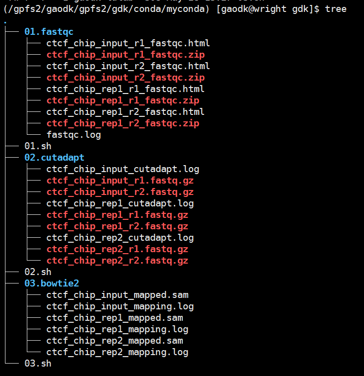
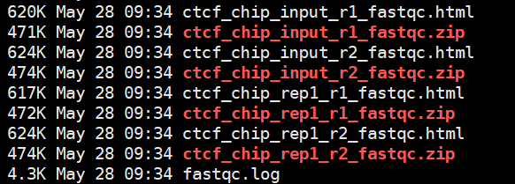
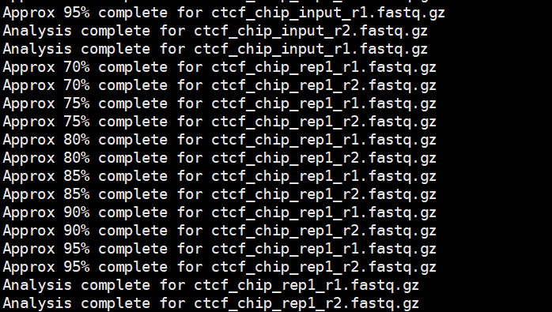
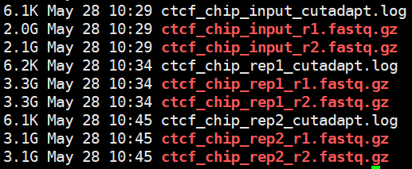
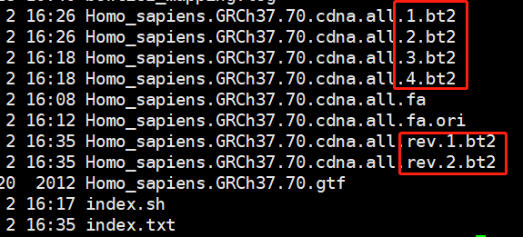
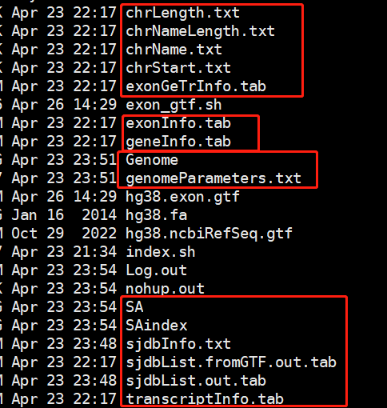
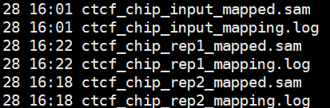

# “Linux 生物信息技术基础”总结报告 12

> 组：G04<br/>次：<br/>组长：高大可<br/>讨论记录：高大可<br/>参与人员：高大可、邓昆月、唐明川、吴航锐<br/>上课时地：2023 年 5 月 22 日，15:10-17:00，35 楼 B107A<br/>讨论时地：2023 年 5 月 28 日，9:00-11:00，35 楼 B104

# 上课内容

# 饶希晨：ChIP-seq

lscpu 查看 cpu

control c --kill

jobs

`cat *.fa > human_genome.fa`

- 运行某个程序时，可以使用 Ctrl+Z 中断程序，再 jobs 查看 job id，再 `bg <job id>` 可以继续运行该程序
- `ps -ef 查看进程`
- `ps -aux|grep` 关键字，可以根据关键字，如用户名、文件目录中的字段、运行程序查找相关程序

## 质量控制和过滤

### 使用 fastqc 对测序 reads 进行质量检测

```powershell
fastqc -t 2 - qc/ ctcf_rep1_read1.fastq.gz ctcf_rep1_read2.fastq.gz > qc/fastqc.log 2>&1 &
# fastqc [options]staq1 [fastq2 ... ]
# -t 指定使用的线程数
# -0 指定输出文件
# *.log 2>&1 将上述命令中的标准输出重定向到fastqc.log文件中，同时将标准错误也重定向到fastqc.log文件中
# 最后一个 & 表示放在<strong>后台进行 -- </strong>可以通过cat fastqc.log 查看运行状态和结果
```


根据 phred 计算，每一个碱基的质量如何。来源于测序仪器，根据测序时的荧光判断质量如何


Per sequence GC 偏离正态分布，但这在 ChIP-Seq 里是正常的


Overrepresented sequenes 里有 adaptor 停列，这可能是因为:

1.adaptor dimer 的污染;

2 不可能所有片段的大于 450bp,肯定还是有-些打断的小片段，这些小片段是可能测出 adaptor 的。

更好的分析：MultiQC


MultiQC 解析

Duplication(Dups)：建库后 PCR 时，同样来源的 DNA 分子形成一个簇，反映的信息是一样的，Dups 低，文库多样性高，数据质量好。

M Seqs：一共测到了多少兆 reads（总 read 数，包含 Dups） -- 反映了测序量有多大

Status check： 每列：质量指标；每行：不同的样本

adaptor：序列较短时会测穿，测出来接头

可能有两种不一样的接头

### 对原始测序数据进行过滤

1. bi

- 使用 cutadapt 去接头 （同时进行质量过滤）

```powershell
cutadapt -j 2 --time 1 -e 0.1 -O 3 --guality-cutff 25 -m 55 -a AGATCGAAGAGCACACTCTACTCCAGTA -A AGATCGAGAGCTCGTGTAGGGAAA6AGTGT -o fix.fastq/test_R1_cutadapt.temp.fastq.gz read1 -p fix.fastq/test_R2_cutadapt.temp.fastq.gz read2 ctcf_rep1_read1.fastq.gz ctcf_rep1_read2.fastq.gz
# -j 2 设置线程数
# -- time 1 只去处一次接头，因为一般情况下接头只出现一次
# -e 0.1 去除的序列与adaptor相比，missmatch率低于该值，则认为adaptor,一般设置为0.1
# -O 3 当与adaptor overlap的碱整数大于等于该值时，才进行去除
# --quality-cutoff 25 小于等于该qulity的碱基去除
# -m 55 trim之后低于该值的一对reads丢弃，一般要大于40
# -a AGATCGGAAGAGCACACGTCTGAACTCCAGTCA read1 3'的adaptor
# -A AGATCGGAAGAGCGTCGTGTAGGGAAAGAGTGT read2 3'的adaptor
# -o fix.fastq/test_R1_cutadapt.temp.fastq.gz read1的输出文件
# -p fix.fastq/test_R2_cutadapt.temp.fastq.gz read2的输出文件
# Read1输入文件
# Read2输入文件
```

- 一般的使用的接头类型有两种  -- 做实验的人自己得知道

  - Truseq -- 不是用 Tn5 酶打断，一般用此接头
  - Nextera -- 用 Tn5 酶打断，一般用此接头

## 比对

> 常用软件：bowtie bowtie2 BWA hisat2 tophat2 star hisat3n<br/>- 根据文库特点选择比对软件

- bowtie2: 适合 CHIPseq 文库，

  - 对 deletion，insertion，mismatch 不敏感/对内存要求比较小
  - 不需要考虑 exon 和 intron
  - 不考虑正负链信息
  - BWT 算法
- BWA 类似于 blast，比较敏感，容忍较多的 mismatch，适合 SNP，
- hisat3n， bisulfite-seq, 需要比对三元碱基，有很多 mismatch

### Build index

index 相比文本文件计算更快

### 比对模式

End to end（默认）：短序列回贴时，头尾头可以比对到。该模式认为 R1/R2 不在同一条链上且 R1/R2 方向有规定，异常序列将会被去除。

local 模式：可以掐头去尾去比对

reads 方向


黑色：appropriate 比对

蓝色：可能会被扔掉

红色：可能会被扔掉。hi-C 文库中可能会 R1\R2 在同一条链上

可能有 single 比对：R1 比对得上，R2 比对不上

Multiple mapping：比对到多个位置，

报告的比对结果：bowtie2 报告一个最好的比对结果

排序，生成 bam 文件：Samtools sort

过滤：Samtools view

-b 输入的是一个 bam 文件 -S 自动检测是什么文件

-q 比对质量筛选

-@ 线程数

-m 内存

- 如果想要查看 bam 文件：

  - 构建索引 samtools index

    - 生成一个 bai 文件
  - samtools view ctcf_chip_input.bam chr1:1000-1000000 | less

> ## 更多资源<br/>EBI：https://www.ebi.ac.uk/<br/>例_Tutorial：https://www.ebi.ac.uk/training/online/courses/functional-genomics-ii-common-technologies-and-data-analysis-methods/#vf-tabs__section--contents<br/>https://www.ebi.ac.uk/training/

# <strong>讨论主题</strong>

ChIP-seq 中质量检测的实现

ChIP-seq 中低质量片段剪切的实现

ChIP-seq 中比对的实现

# 讨论内容

目录结构



## 质量检测——fastqc

```powershell
nohup fastqc -t 20 -o 01.fastqc \
        /DIRECTORY/data/*.fastq.gz > 01.fastqc/fastqc.log 2>&1 &
```

对存放 rawdata 目录中所有的 fastq 文件进行质控



程序自带输出为每个输入的.html 文件和.zip 文件

由脚本得出的输出为 log 文件，记录了多个文件的质控状态。可输出为同一个 log 文件，或单独每个每个 fastq 文件生成 log 文件



## 低质量片段剪切——cutadapt

```powershell
for i in ctcf_chip_rep1 ctcf_chip_rep2 ctcf_chip_input
do
        nohup cutadapt -j 5 --time 1 -e 0.1 -O 3 --quality-cutoff 25 -m 55 \
                -a AGATCGGAAGAGCACACGTCTGAACTCCAGTCA -A AGATCGGAAGAGCGTCGTGTAGGGAAAGAGTGT \
                -o ./02.cutadapt/${i}_r1.fastq.gz \
                -p ./02.cutadapt/${i}_r2.fastq.gz \
                /DIRECTORY/data/${i}_r1.fastaq.gz \
                /DIRECTORY/data/${i}_r2.fastaq.gz \
                > ./02.cutadapt/${i}_cutadapt.log 2>&1 &
done
```

使用 for 循环并行、在后台不挂起地进行 cutadapt，去除低质量片段、短片段

输入为原始数据，即上一步 fastqc 产生的文件不参与后续数据处理

当使用脚本进行后台运行操作时，注意单个进程使用的线程、总线程数，防止占用过多公共资源

生成 3 个 log 文件（来自于 3 个 for 循环），6 个 fastq.gz 文件（每个文件对应一个 rawdata）。



## 比对——bowtie2

### 3.1 bowtie2-build

```powershell
bowtie2-build -f ./hg38_human.fa <strong>hg38</strong> > build_index.log 2>&1 &
```

第二个参数[hg38]为 index 前缀

生成 6 个 index 文件，产生的 6 个 index 文件类型如图



注意：每个比对软件生成的 index 不相同，比对时需要使用同一软件建立的 index

如，STAR 建立的 index 如下



### 3.2 bowtie2

```powershell
for i in ctcf_chip_rep1 ctcf_chip_input ctcf_chip_rep2
do
        nohup bowtie2 -x /DIRECTORY/Homo_sapiens.GRCh37.70.cdna.all \
                -1 02.cutadapt/${i}_r1.fastq.gz \
                -2 02.cutadapt/${i}_r2.fastq.gz \
                -p 4 -S 03.bowtie2/${i}_mapped.sam > ./03.bowtie2/${i}_mapping.log 2>&1        &
done
```

注意！-x 参数后的参考地址写到注释文件的前缀，即 bowtie2-build 时使用的前缀

生成文件如下：



可使用 log 文件中的信息判断测序数据质量

## 如何监测某一程序是否运行完毕

（1）在脚本中添加 echo 语句，当运行完毕后输出信息到屏幕

（2）ps -aux|grep 关键字。监控是否有相关程序在运行

关键字可为：

用户名：会输出当前用户的所有进程，包括部分系统进程

使用软件：如 cutadapt，会输出软件相关的进程；有时单个来自用户的命令会调用多个不同的程序

pid：精准获取某个进程的信息

（3）查看生成的 log 文件（辅助手段）

（4）查看文件大小、最后编辑时间，是否还在变化（辅助手段）
