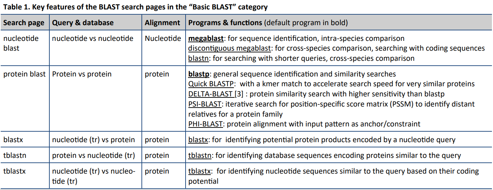
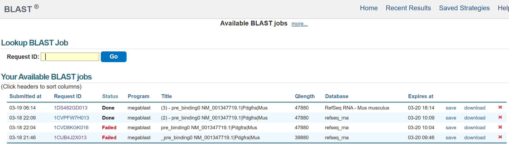
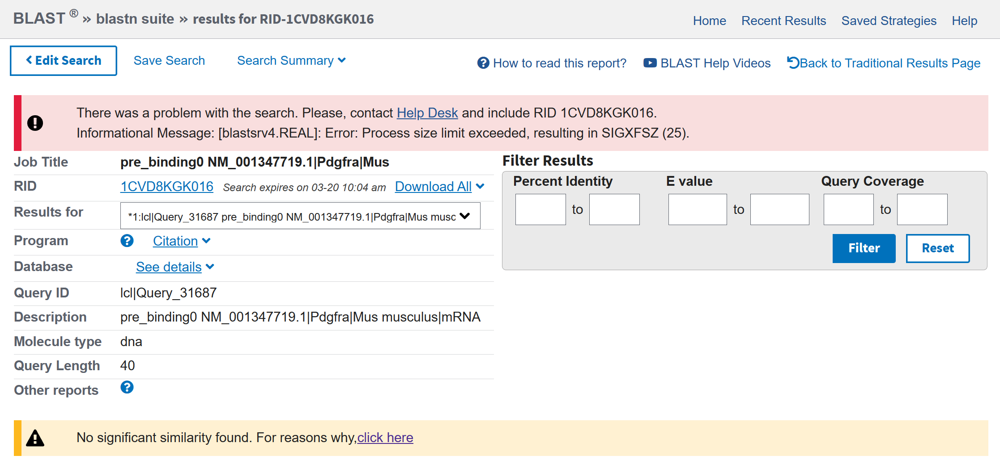
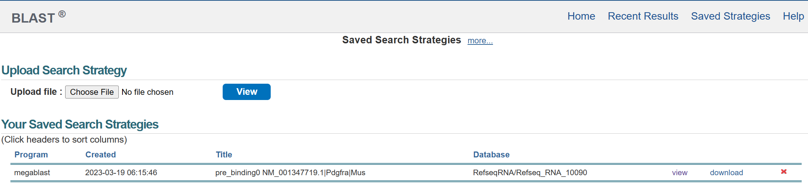

# “Linux 生物信息技术基础”总结报告 3

> 组：G04 <br/>次：3<br/>组长：高大可<br/>执笔：唐明川<br/>参与人员：高大可、邓昆月、唐明川、吴航锐<br/>时间：2023 年 3 月 19 日，19:30-21:30。 <br/>地点：35 楼 B104

# <strong>主题</strong>

1. BLAST 主要功能
2. NCBI_BLAST 的搜索策略保存
3. word size&积分矩阵: wordsize,积分矩阵是什么？如何优化 blast 参数？例如如何提高灵敏度？
4. 在 python 中使用 NCBI_BLAST
5. 配置本地 BLAST

# 内容

## BLAST 主要功能

ncbi_BLAST 主要有 blastn、blastp、blastx、tblastn 和 tblastx 五种功能

其中 BLASTn 是核酸与核酸比对的方法，有三种程序，megablast，discontiguous megablast 和 blastn，查询其使用文档后我们对第二种策略有所疑惑，其介绍为<em>‘cross-species comparison, searching with coding sequence’</em>，经讨论，总结出其作用是比对编码序列。

BLASTp 是蛋白与蛋白比对的方法，上课提到的 PSI-BLAST 就是其中的一种程序，其打分矩阵为 PSSM，可以实现亲缘关系较远的蛋白比对。

<em>以下是来自 new bing 的解释</em>

<em>PSSM stands for </em><strong>Position Specific Scoring Matrix</strong><em>. It is a matrix that takes the alignment of your protein to a list of homologs and counts the amino acids found at each position for the homologs. </em><em>This is an easy way of measuring evolutionarily related mutations accepted at each position</em><em>. </em><em>It is a widely used and highly informative representation of protein sequences</em><em>.</em>

<em>To create a PSSM, you need three things: your protein sequence, a database of protein sequences that contains potential homologs, and the program that will create the PSSM</em><em>. </em><em>Your protein sequence needs to be put in fasta format and saved as name.fasta (using any name)</em><em>.</em>



<em>blast 功能介绍</em>

> ### 参考资料<br/>Guide to BLAST home and search pages<br/>Blast quick start guide

## NCBI_BLAST 搜索策略保存

在完成 BLAST 比对后，可以在比对结果页面和近期记录页面保存某一次比对的策略，如图：



<em>可在该图中点击’save’保存搜索策略</em>



<em>可在该图中点击左上角‘Save Search’保存搜索策略</em>

可以点击右上角‘Saved Strategies’进入搜索策略页面查看保存的策略，点击 view 可以查看策略细节，点击 download 可以将搜索策略下载为一个 ASN.1 文件，便于分享。也可以在页面左上角‘Upload file’处上传已有的搜索策略。



<em>搜索策略页面</em>

## Word size 和积分矩阵

Word size 和积分矩阵是 BLAST 算法中的两个重要参数。Word size（W）指的是在查询序列中用于匹配数据库序列的单词长度。积分矩阵（scoring matrix）用于计算序列比对的得分。

调整这些参数可以优化 BLAST 搜索。例如，如果 T 与 W 成比例缩放，则较小的 word size 会增加灵敏度并降低速度。W，T 和积分矩阵之间的相互作用至关重要，明智地选择它们是控制 BLAST 速度和灵敏度最有效的方法。

> ### 参考资料<br/>The BLAST Algorithm

## 在 python 中使用 NCBI_BLAST

通过 biopython 库中的函数，Bio.Blast.NCBIWWW.qblast 在程序中进行 blast，其中 BLAST 选项与网页端 blast 类似，可以将 BLAST 结果保存为 TXT 或 XML 格式数据。其中的参数含义可参考 help(NCBIWWW.qblast)使用文档。

案例代码如下：

```python
# blast and xml file process
from Bio.Blast import NCBIWWW
from Bio.Blast import NCBIXML
with open(file_out_dir+total_pre_binding_file_name, 'r') as f:
    fasta_string = f.read()
txid = [2697049]  # organism
# submit BLAST search and get handle object
handle = NCBIWWW.qblast(program='blastn', megablast="yes",
                        database='refseq_rna', sequence=fasta_string,
                        url_base='https://blast.ncbi.nlm.nih.gov/Blast.cgi', 
                        format_object='Alignment',
                        format_type='Xml')
# read handle object and save to a file for latter process
with open(tmp+blast_results_file, 'w') as f:
    f.write(handle.read())
```

但是，当 BLAST 数据量过大或者网络环境不佳（如 proxy 不稳定）时，BLAST 很容易断连，且 BLAST 服务器常出现挤兑的情况，导致比对速度过慢。因此配置 local BLAST 可以有效增加 BLAST 稳定性和比对速度。

> ### 参考资料<br/>BLAST 参数介绍<br/>NCBI_ElasticBLAST<br/>BlastRecord<br/>NCBIXML: a part from package biopython to read NCBIXML file<br/>XMLReader: an online .xml file reader

## 配置本地 BLAST

用 python 进行 BLAST，当 BLAST 数据量过大或者网络环境不佳（如 proxy 不稳定）时，BLAST 很容易断连，且 BLAST 服务器常出现挤兑的情况，即使是使用 web 进行 BLAST，比对速度也可能会很慢。因此配置 local BLAST 可以有效增加 BLAST 稳定性和比对速度。local BLAST 由 ncbi BLAST 和数据库组成，用户可根据自己需要的数据库选择性下载，如 rna_reference 数据库 300GB 左右，rna_select 数据库不超过 50GB。

```bash
cp /rd1/home/public/BLAST/BLAST_TOOL/ncbi-blast-2.13.0+-x64-linux.tar.gz ~/install 

# 解压解包
gunzip ncbi-blast-2.13.0+-x64-linux.tar.gz
tar xvf ncbi-blast-2.13.0+-x64-linux.tar

# 复制可执行程序
cp -rf install/ncbi-blast-2.13.0+/bin/ ~/bin/blast_bin/

# 用户根目录隐藏文件.ncbirc用于指定索引文件位置
# Specifies the path where BLAST databases are installed
[BLAST]
BLASTDB=/rd1/home/public/blast_db

# 创建索引文件
ln -s /rd1/home/public/blast_data/sbp/ZMTF_PEP.FASTA . 
ln -s /rd1/home/public/blast_data/sbp/ZMTF_CDS.FASTA .
makeblastdb -dbtype prot -in ZMTF_PEP.FASTA -out ZMTF_PEP
makeblastdb -dbtype nucl -in ZMTF_CDS.FASTA -out ZMTF_CDS
```

> ### 参考资料<br/>罗静初, Linux 生物信息基础_第 3 讲_序列相似性数据库搜索系统 BLAST<br/>[https://www.ncbi.nlm.nih.gov/guide/howto/dwn-records/](https://www.ncbi.nlm.nih.gov/guide/howto/dwn-records/)

# 问题

1. linux 服务器下是否有类似 gedit 的可用鼠标交互的编辑器；
2. NCBI 数据库结构是什么样的；
3. 作为 linux 服务器的管理员，如何管理各个账户；
