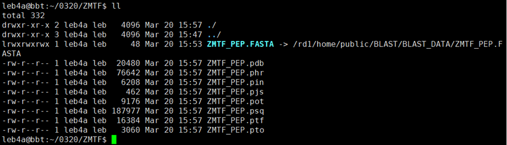
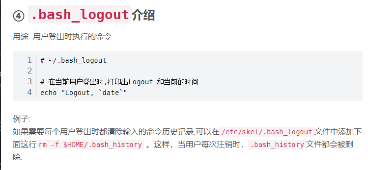
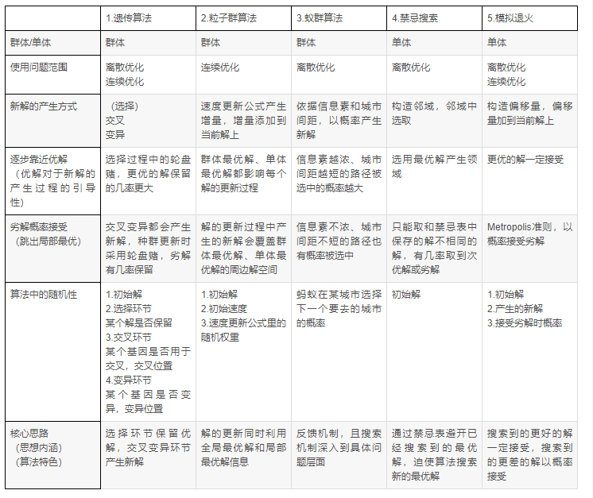

# “Linux 生物信息技术基础”总结报告 4

> 组：G04<br/>次：4<br/>组长：高大可<br/>讨论记录：吴航锐<br/>参与人员：高大可、邓昆月、唐明川、吴航锐<br/>上课时地：2023 年 3 月 20 日，15:10-17:00，35 楼 B107A<br/>讨论时地：2023 年 3 月 26 日，19:30-21:30，35 楼 B104

# 上课内容

## BLAST 数据库索引制作

新版 blast 产生 6 个索引序列



## BLAST 环境变量配置——home 目录下的.bashrc 文件和.profile 文件

完成 BLAST 安装后，为了能在环境中直接使用 blast 中的函数，需将 blast 文件包中的 `bin` 文件夹加入环境变量，这可以通过手动修改 `$HOME/.profile` 文件实现。

```bash
# add the following code to the ~/.profile using vim/nano or other editor
# "~/.app/BLAST/ncbi-blast-2.13.0+/bin" is customized dir of your program's bin 

# set blast bin to PATH TangMingchuan 20230320
if [ -d "$HOME/.app/BLAST/ncbi-blast-2.13.0+/bin" ]; then 
    PATH="$HOME/.app/BLAST/ncbi-blast-2.13.0+/bin:$PATH"
fi
```

#### .profile 文件

```bash
# if running bash
 if [ -n "$BASH_VERSION" ]; then
     # include .bashrc if it exists
     if [ -f "$HOME/.bashrc" ]; then
     . "$HOME/.bashrc"
     fi
 fi

 # set PATH so it includes user's private bin if it exists
 if [ -d "$HOME/.local/bin" ] ; then
     PATH="$HOME/.local/bin:$PATH"
 fi
```

#### .bashrc 文件

.bashrc 与

以下展示了一些好用的配置，其中 alias 可用于配置快捷命令。

可以看到，anaconda 安装时也会将程序路径写入.bashrc 文件中，因此，在安装老版本 anaconda 第一次使用无法通过 `conda` 命令直接调用，可以在~路径下运行 `source .bashrc` 进入 conda 环境（在 conda 环境中通过 `conda update` 更新 anaconda 版本后可将 `conda` 命令加入环境变量）。

```bash
# some more ls aliases
 alias ll='ls -alF'
 alias la='ls -A'
 alias l='ls -CF'

 # added by Anaconda3 2018.12 installer
 # >>> conda init >>>
 # !! Contents within this block are managed by 'conda init' !!
 __conda_setup="$(CONDA_REPORT_ERRORS=false '/home/akikawa/.app/anaconda3/bin/conda' shell.bash hook 2> /dev/null)"
 if [ $? -eq 0 ]; then
     \eval "$__conda_setup"
 else
     if [ -f "/home/akikawa/.app/anaconda3/etc/profile.d/conda.sh" ]; then
         . "/home/akikawa/.app/anaconda3/etc/profile.d/conda.sh"
         CONDA_CHANGEPS1=false conda activate base
     else
         \export PATH="/home/akikawa/.app/anaconda3/bin:$PATH"
     fi
 fi
 unset __conda_setup
 # <<< conda init <<<
```

<strong>What is the difference between .bashrc and .profile</strong>

`.bashrc` file defines settings for a user <strong>when running a subshell</strong>. It is executed for an interactive non-login shell.

`.profile` (or `.bash_profile`) is read and executed when Bash is invoked as an interactive login shell. You can use `.bash_profile` to run commands that should <strong>only run once</strong>, such as customizing the `$PATH` environment variable.

相较而言.profile 更为底层

# <strong>讨论主题</strong>

1. SPL 家族转录因子参与拟南芥多种性状的调节。在玉米中是否有与 SPL3D 同源的序列?
2. 系统软件安装（例如安装 anaconda 后是否能直接改变安装目录）
3. ${PATH}等变量
4. 用户拥有的系统隐藏文件

# 内容

## SPL 家族转录因子参与拟南芥多种性状的调节。

在玉米中是否有与 SPL3D 同源的序列?

> 使用 SPL3_PEP 搜索构建的玉米数据库 (能找到)<br/>使用 SPL3_CDS 搜索构建的玉米数据库 (不能找到)<br/>表明低相似性的核酸序列编码高相似性的蛋白质. -- 同一种氨基酸可能对应多种密码子，因此造成蛋白质同源的序列，对应的编码蛋白质的核酸不同源。

## 系统软件安装（例如安装 anaconda 后是否能直接改变安装目录）

conda 需要添加的环境变量非常多

在 linux 中任何地方输入 `env` 可查看环境变量，anaconda 在安装过程中会在 $PATH 外添加若干环境变量，如：

```css
CONDA_SHLVL=1
CONDA_EXE=/rd1/home/leb4c/.app/anaconda3/bin/conda
CONDA_PREFIX=/rd1/home/leb4c/.app/anaconda3
CONDA_PYTHON_EXE=/rd1/home/leb4c/.app/anaconda3/bin/python
_CE_CONDA=
CONDA_PROMPT_MODIFIER=(base)
CONDA_DEFAULT_ENV=base
```

若要直接移动软件所在文件夹，则需要一一修改环境变量才能正常启动，除此之外，应用内部也有一些非环境变量的变量，若逐一修改将会

## $ {PATH}等变量

PATH 为环境变量，用于保存可供搜索的目录路径，如果将要运行的程序不在当前目录，操作系统会一次搜索 PATH 变量中的目录，若在目录中找到待运行的程序，操作系统即可运行该程序

临时修改

```
export PATH=$PATH:/home/xiaomin/go/bin
```

若要永久修改，直接修改.bashrc 等文件

### 环境变量

环境变量是一种存储系统配置信息的变量，它们可以被所有运行在系统中的进程访问。不同的环境变量具有不同的作用，下面是一些常见的环境变量及其作用：

- `${HOME}`：表示当前用户的主目录。例如，在 Ubuntu 系统中，`${HOME}` 环境变量的值通常为 `/home/username`，其中 `username` 是当前用户名。
- `${PATH}`：表示系统查找<strong>可执行文件</strong>时要搜索的目录列表。当在命令行中输入一个命令时，系统会按照 `${PATH}` 环境变量中指定的顺序依次搜索每个目录，直到找到可执行文件为止。
- `${USER}`：表示当前用户名。
- `${LANG}`：表示当前语言环境。这个环境变量用于控制应用程序使用的语言和字符编码。
- `${PWD}`：表示当前工作目录。当您在命令行中运行命令时，`${PWD}` 环境变量的值表示命令运行时所在的目录。
- `${SHELL}`：表示当前用户使用的默认 shell 程序。例如，在 Ubuntu 系统中，`${SHELL}` 环境变量的值通常为 `/bin/bash`。

这些只是一些常见的环境变量，实际上还有许多其他的环境变量。可以使用 `env` 命令查看当前系统中定义的所有环境变量及其值。

## 其他用户拥有的系统隐藏文件

4.1. .bash_history

保存当前用户使用过的历史命令

4.2. .bash_logout

保存当前用户登出时执行的命令



（来源：[https://blog.csdn.net/u011479200/article/details/86501366](https://blog.csdn.net/u011479200/article/details/86501366)）

4.3. .Xauthority

```
储存用户的身份验证信息
```

4.4. (directory) .cache

存放缓存文件

可使用 drop_caches 释放内存

4.5. (directory) .vim

.vim/下包含多个 vim 的配置文件

~/.vim/plugin/：存放每次启动 vim 都会被运行一次的插件

~/.vim/ftdetect/：中的文件在 vim 启动时就运行。ftdetect 代表的是“filetype detection（文件类型检测）”。此目录中的文件应该用自动命令（autocommands）来检测和设置文件的类型。

~/.vim/ftplugin/：当 vim 给缓冲区的 filetype 设置一个值时，vim 将会在~/.vim/ftplugin/ 目录下来查找和 filetype 相同名字的文件。例如你运行 set filetype=derp 这条命令后，vim 将查找~/.vim/ftplugin/derp.vim 此文件，如果存在就运行它。还会运行 ftplugin 下相同名字的子目录中的所有文件，如~/.vim/ftplugin/derp/这个文件夹下的文件都会被运行。每次启用时，应该为不同的文件类型设置局部缓冲选项，如果设置为全局缓冲选项的话，将会覆盖所有打开的缓冲区。

~/.vim/indent/：与 ftplugin 中的文件相似，根据名称加载的，放置了相关文件类型的缩进。如 python 应该怎么缩进，java 应该怎么缩进等。

~/.vim/compiler/：相应文件类型应该如何编译。

~/.vim/after/：在 vim 每次启动的时候加载，不过是等待~/.vim/plugin/加载完成之后才加载 after 里的内容，所以叫做 after。

~/.vim/doc/：插件放置文档的位置。如:help。

~/.vim/spell/：拼写检查脚本。

~/.vim/syntax/：语法描述脚本。

（来源: [https://www.cnblogs.com/chris-cp/p/4581593.html](https://www.cnblogs.com/chris-cp/p/4581593.html)）

## 启发性算法

启发式算法（heuristicalgorithm)是相对于最优化算法提出的。一个问题的最优算法求得该问题每个实例的最优解。启发式算法可以这样定义：一个基于直观或经验构造的算法，在可接受的花费（指计算时间和空间）下给出待解决组合优化问题每一个实例的一个可行解，该可行解与最优解的偏离程度一般不能被预计。



（来源：[https://blog.csdn.net/HUST_zxs/article/details/119893514](https://blog.csdn.net/HUST_zxs/article/details/119893514)）

模拟退火算法的基本思想是模拟金属在退火过程中冷却时的行为。在开始时，算法会随机生成一个解，并将该解作为当前的最优解。之后，算法会进行一系列的迭代，每一次迭代中，算法会对当前解进行随机扰动，然后计算扰动后的解的函数值。如果新的解比当前最优解更优，则接受该解，并将其作为新的最优解。如果新的解比当前最优解差，则有一定概率接受新的解，以避免陷入局部最优解而无法跳出。

模拟退火算法的核心是温度参数，该参数控制着算法接受劣解的概率。在开始时，温度较高，接受劣解的概率也较高。随着迭代的进行，温度会逐渐降低，接受劣解的概率也会降低。当温度降到一定程度时，算法将不再接受劣解，并返回当前的最优解。

模拟退火算法伪代码

```sql
Let s = s(0)
For k = 0 through k(max) (exclusive):
<em>T</em> ← temperature( 1 - <em>(k+1)</em>/<em>k</em>(max) )
Pick a random neighbour, <em>s</em>(new) ← neighbour(<em>s</em>)
If <em>P</em>(<em>E</em>(<em>s</em>), <em>E</em>(<em>s</em>(new)), <em>T</em>) ≥ random(0, 1):
<em>s</em> ← <em>s</em>(new)
Output: the final state s
```

## 预习：马尔可夫模型与隐马尔可夫模型

区别：来自于 Chat-GPT 的回答

马尔可夫模型和隐马尔可夫模型都是用来描述随机过程的模型，但它们之间有以下不同之处：

1. 马尔可夫模型是一种<strong>状态转移模型</strong>，它假设当前状态<strong>只与前一个状态有关</strong>，而与之前的状态和未来的状态无关。因此，它可以用<strong>一个状态转移矩阵</strong>来描述状态之间的转移概率。而隐马尔可夫模型则是一种包含隐含状态的马尔可夫模型。在隐马尔可夫模型中，状态是隐含的，而观测值是可见的。因此，隐马尔可夫模型除了状态转移矩阵外，还需要一个<strong>观测概率矩阵</strong>来描述状态与观测值之间的关系。
2. 在马尔可夫模型中，每个状态都有一个确定的观测值。而在隐马尔可夫模型中，每<strong>个状态都可以对应多个观测值，且不同的状态可以对应相同的观测值</strong>。这是因为在隐马尔可夫模型中，状态与观测值之间的关系是具有概率上的关系。

总之，马尔可夫模型和隐马尔可夫模型在描述随机过程的时候有着不同的假设和应用场景。<strong>马尔可夫模型</strong>用于描述具有<strong>明确状态的</strong>系统，而<strong>隐马尔可夫模型</strong>则用于描述<strong>隐含状态的系统</strong>。

# 问题

1. blast 使用的启发式算法是哪一种？怎样代码实现？
2. blast 数据库的数据结构是什么？
