# “Linux 生物信息技术基础”总结报告 5

> 组：G04<br/>次：5<br/>组长：高大可<br/>讨论记录：高大可<br/>参与人员：高大可、邓昆月、唐明川、吴航锐<br/>上课时地：2023 年 3 月 27 日，15:10-17:00，35 楼 B104<br/>讨论时地：2023 年 4 月 1 日，10:00-12:00，35 楼 B104

# 上课内容

## tmux-好用的 linux 分屏程序

tmux 可以创建分屏的工作环境，如果需要持续运行耗时较长的程序，可以使用 tmux 创建一个窗口来执行。这本质上和另开一个终端没有区别，主要是提供方便：

1. 提高屏幕使用率
2. 后台挂起程序

### tmux 安装

安装 tmux：`sudo apt-get install tmux`

打开 tmux：`tmux`

### 快捷键使用

#### 分屏

分屏操作：`Ctrl+B`，`%` 左右分屏，`"` 上下分屏

切换分屏：`Ctrl+B`，左右方向键；或者 `Ctrl+B`，o（键盘上的字母 o）

快速切换分屏：`Ctrl+B`，上下左右方向键切换（有一个用数字的是什么？）

调整分屏大小：`Ctrl+B`, `ctrl``+左右方向键(慢)``/``alt+``左右方向键(快)`

#### 进程管理

关闭分屏：直接输入 `exit` 杀死分屏

挂起：`Ctrl+B`，`D`

```powershell
# 基本信息查看（查看有哪些tmux任务）
tmux ls
# 重新进入
tmux attach -t <session-name>  # 默认：tmux attach
# 开启新的tmux
tmux new -s <session-name> # 默认：tmux
# 关闭tmux进程
# 关闭所有进程
tmux kill-server
# 关闭指定进程
tmux kill-session -t <session-name>
# 关闭上次打开的会话
tmux kill-session
# 关闭除s1外的所有会话
tmux kill-session -a -t s1
```

> tmux 快捷键冲突：`ctrl+b` 在 linux 系统内有翻页功能，`tmux` 的 `ctrl+b` 担任 trigger 功能，会和原有功能冲突<br/>tmux 挂起后不会结束进程，会占用后台程序，彻底关闭需要结束进程

### htop 与 top

第 1,2,...,i 个 cpu 核心的状态

Mem: 内存状态

Swp: 交换内存

用户一般可以在 top 无法提供详尽系统信息的情况下选择安装并使用 htop。比如，在查找应用程序的内存泄漏问题时。与 top 相比，htop 提供更方便、光标控制的界面来杀死进程

## conda-环境管理神器

Anaconda 和 miniconda 的区别

Anaconda 是一个用于科学计算的<strong>Python 和 R</strong>编程语言的发行版，旨在简化包管理和部署。它包括超过 7000 个开源包的集合 。Miniconda 是一个最小的 conda 安装程序，<strong>仅包括 conda、Python 和它们所依赖的包</strong> 。Miniconda 允许创建一个最小的独立 Python 环境配置。

### 安装方法

```powershell
# 使用wget下载conda.sh文件
wget https://repo.anaconda.com/miniconda/Miniconda3-latest-Linux-x86_64.sh
bash Miniconda3-latest-Linux-x86_64.sh
### 如果在安装过程中没有initialize，则需要手动initialize
export PATH="~/Miniconda3/bin":$PATH
source ~/Miniconda3/bin/activate #修改终端的默认 python 为 anaconda
```

### 常见指令及使用方法

#### 环境管理

```powershell
# 激活/切换环境
conda activate <env_name> # 默认base
# 创建环境
conda create -n <env_name> python/r-base=<python/r_version> package=<>
conda create -n python_env python=3.9 package=matplotlib
conda create -n r_env r-base=<em>4.1.2</em> r-esstial 
# 删除环境
conda remove -n <env_name>1
# 查看用户所有环境
conda env list
# 查看环境中的包
conda list
```

#### 安装 package

```bash
# 安装软件包
conda install <package_name>
# 从指定的channel中安装package
conda install -c bioconda <package_name>
# 从本地安装package
conda install --use-local <path> #path: the absolute path of pacakge local
```

#### 设置 package channels

```powershell
# 查看当前下载包的channel
conda config --show channels
# 增加包的channel
conda config --add channels <name/link> # name=defaults, conda-forge, bioconda, gtcg, r
conda config --add channels https://mirrors.tuna.tsinghua.edu.cn/anaconda/pkgs/main/ #清华镜像
conda config --add channels https://mirrors.tuna.tsinghua.edu.cn/anaconda/pkgs/free/
conda config --add channels https://mirrors.tuna.tsinghua.edu.cn/anaconda/cloud/conda-forge/ 
conda config --add channels https://mirrors.tuna.tsinghua.edu.cn/anaconda/cloud/bioconda/ 
conda config --add channels https://mirrors.tuna.tsinghua.edu.cn/anaconda/pkgs/r/ 
conda config --set show_channel_urls yes
# 删除旧镜像源：
conda config --remove channels <name/link>
```

> 其他资源：[https://mp.weixin.qq.com/s/vhSpEoIkYP5Hky0lnyGVvQ](https://mp.weixin.qq.com/s/vhSpEoIkYP5Hky0lnyGVvQ)

# <strong>讨论主题</strong>

## 如何配置一个可以远程访问 linux 服务器上文件的 vscode

## 其他后台挂起运行程序的方式

# 内容

## 如何配置一个可以远程访问 linux 服务器上文件的 vscode

在 vs-code 的 extension 中搜索 remote-ssh 并安装

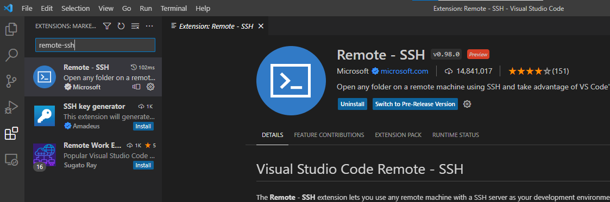

配置.config 文件

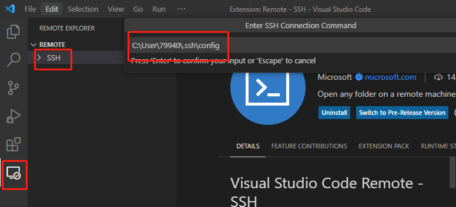

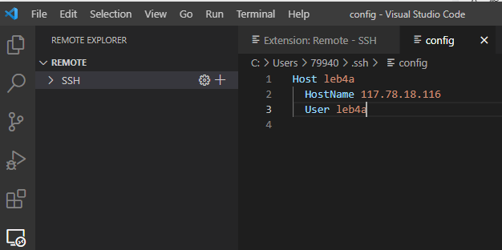

右键添加扩展设置

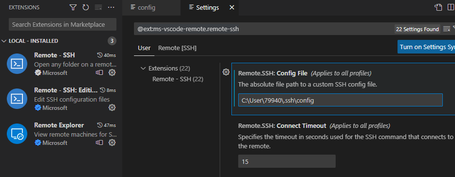

勾选首选项中显示登录窗口，以输入密码

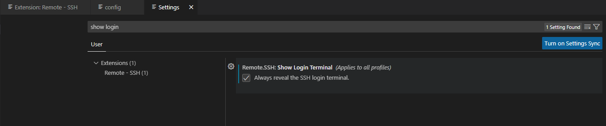

在 win10 中安装 open-SSH 客户端，可使用“应用与程序”或“windows power shell”

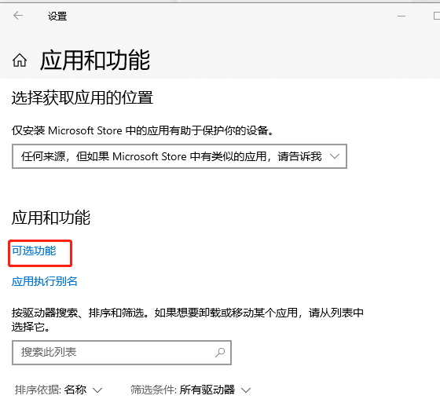

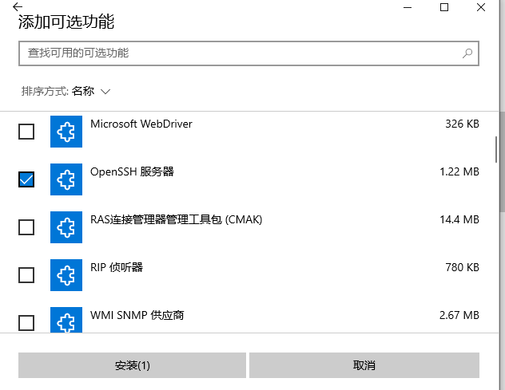

在 vs code 中登录

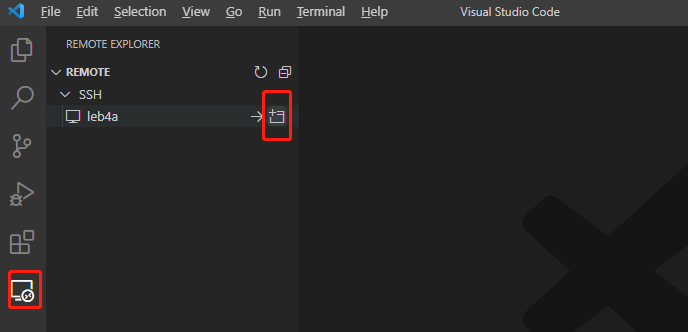

在提示后输入密码

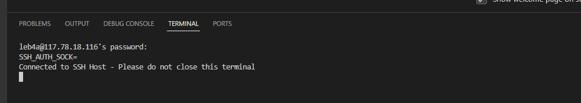

可以通过 vs-code 清晰展示各个文件、路径，可在展示 termial 的同时修改文件内容

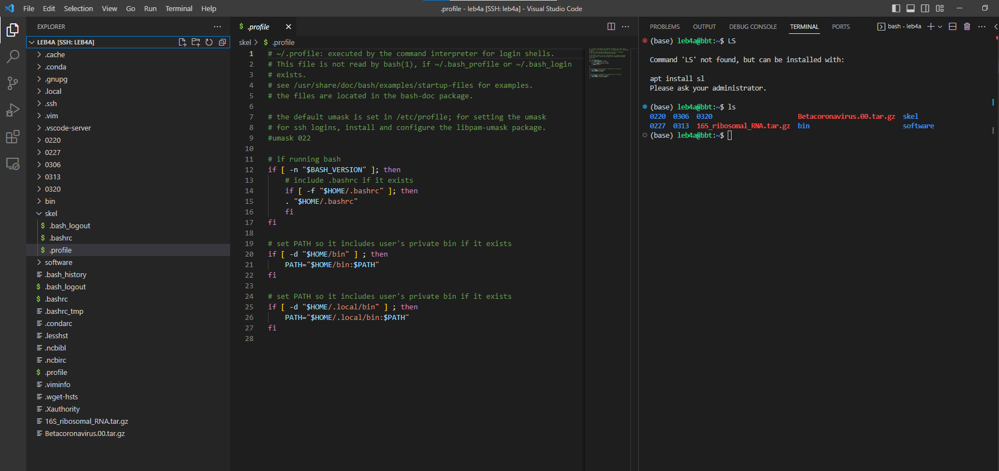

配置免密码登录：

在 CDM 中获取密钥

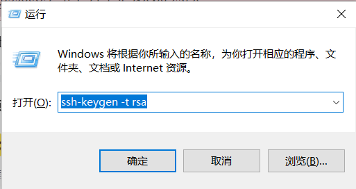

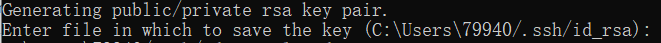

文件中生成了公钥、私钥

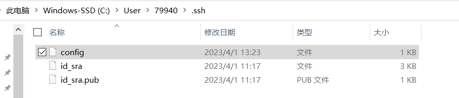

在配置文件中添加密钥地址，注意为不含.pub 后缀的文件

```powershell
#Read more about SSH config files: https://linux.die.net/man/5/ssh_config
Host leb4a
    HostName 117.78.18.116
    #服务器地址
    User leb4a
    #登录服务器时的用户名
    PreferredAuthentications publickey
    IdentityFile "C:\Users\79940\.ssh\id_rsa"
    #本地密钥文件地址
```

在服务器下.shh 文件夹中，使用 touch 新建 authorized_keys 许可文件，将公钥.pub 文件中的内容复制到 authorized_keys 中

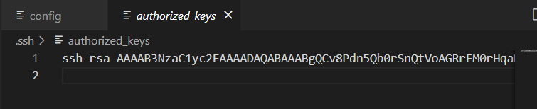

即可完成不输入密码登录。

> 参考资料<br/>[https://blog.csdn.net/qq_42669026/article/details/104056358](https://blog.csdn.net/qq_42669026/article/details/104056358)<br/>[https://blog.csdn.net/zhangjiuding/article/details/129478438](https://blog.csdn.net/zhangjiuding/article/details/129478438)

## 其他后台挂起运行程序的方式

### 终端复用器 screen

与 tmux 的区别为 screen 中没有<strong>tmux</strong>每个会话中窗口和窗格的概念。

#### 创建新会话

```powershell
screen
#创建新会话并进入；
screen -S name 
#创建一个名为name的会话并进入；（推荐做法）
```

```powershell
#退出当前会话：依次按下 ctrl + a ctrl + d
screen -ls
#列出已创建会话
```

#### 重新进入会话

```powershell
screen -r pid 
#使用pid号重新进入；
screen -r name 
#使用会话名称重新进入；
#同时可使用该命令切换会话
```

#### 关闭会话

在 screen 创建的会话中可以依次按下键盘 ctrl + a k 关闭当前会话，也可以输入 exit 命令来关闭；

### 2.2 nohup &指令

以下载 SRR1630828 为例

```powershell
nohup wget https://sra-pub-run-odp.s3.amazonaws.com/sra/SRR1630828/SRR1630828 >> 1.txt 2 >& 1 &
#>> 1.txt: 将所有输出重定向到1.txt
#2 >& 1: 将标准错误和标准输出都重定向
#& : 后台运行
```

运行后可使用 ps 指令查看相关进程，使用 grep 指令找到与 wget 有关的进程

此处也可直接 grep 进程号

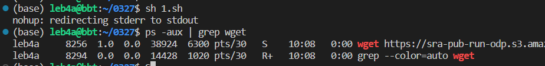

1.txt 中生成的文件

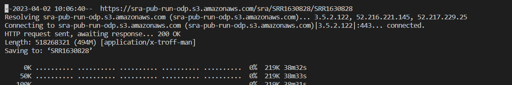
