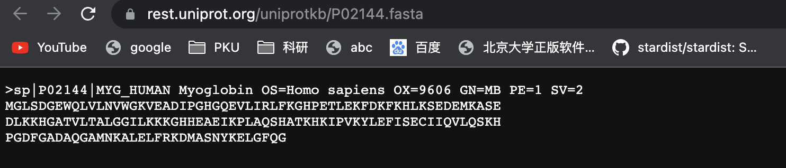
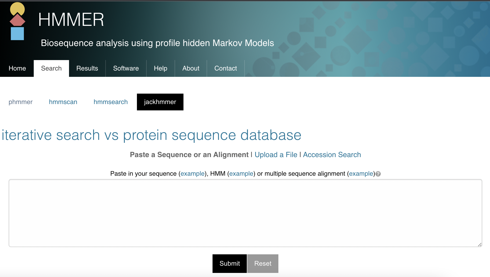
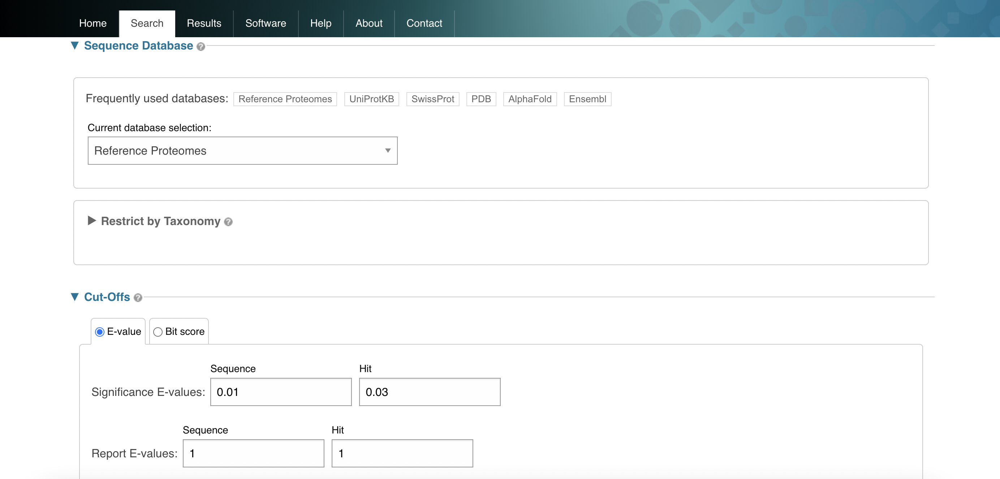
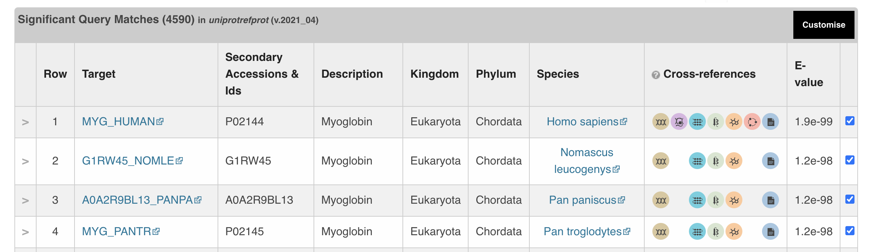
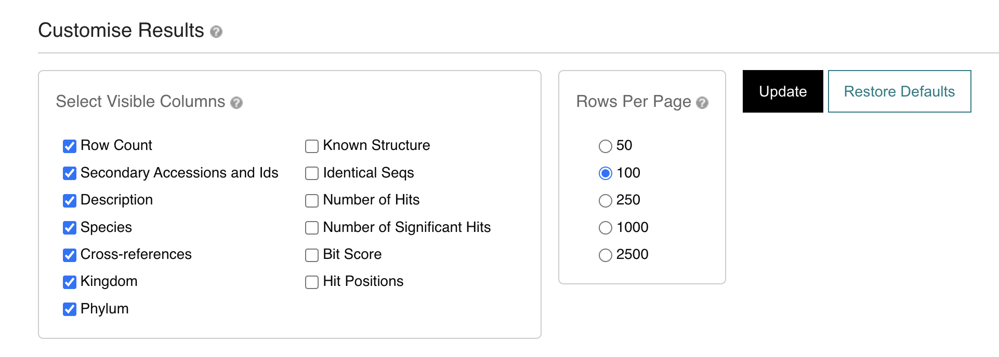
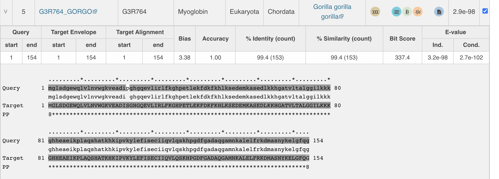
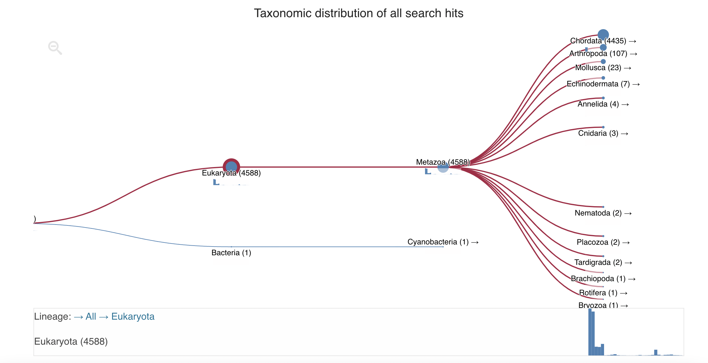
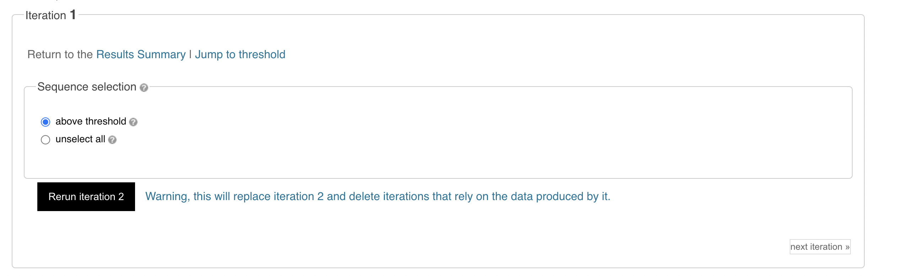
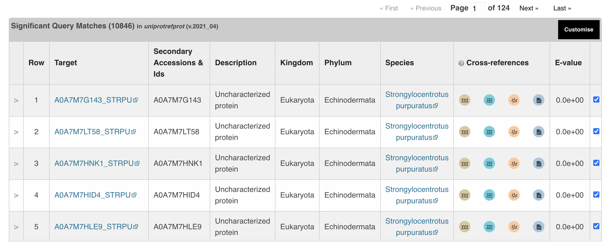
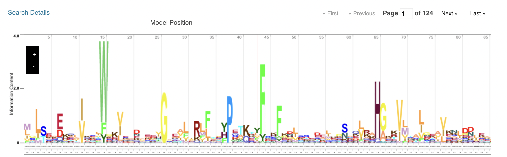

# “Linux 生物信息技术基础”总结报告 7

> 组：G04<br/>次：7<br/>组长：高大可<br/>讨论记录：唐明川<br/>参与人员：高大可、邓昆月、唐明川、吴航锐<br/>上课时地：2023 年 4 月 10 日，15:10-17:00，35 楼 B107A<br/>讨论时地：2023 年 4 月 15 日，10:00-12:00，35 楼 B107B

# 上课内容

## shell 脚本编程实例——fastasplit

<em>运行当前目录下的可执行文件需要加</em><em>./</em><em>，否则系统会在环境变量中寻找可执行文件</em>

```powershell
#!/bin/bash

echo "This script will help you split FASTA files"
if [ $# -ne 1 ]; then
    echo "Usage: $0 <input_file.fasta>"
    exit 1
fi

elif [ -f $1 ]    
# $0:shell文件名 $1:第一个变量... $n:第n个变量
# []，test命令，[]和if间的空格是必须的，[]中的括号是否是必须的？
then
        #-f file        检测文件是否是普通文件（既不是目录，也不是设备文件），
        #               如果是，则返回 true。
        num=$(cat $1 | grep -c ">")
        # -c：只提取匹配的行数（numbers of certain rows）。
        echo "Number of sequences is: $num"
        fasta="$(cat $1)"
        while ((${num}>0))
        # (()) 之中内容可以按照c语言规则来读取
        # while和(())之间必须有空格，(())中的空格可有可无，${}标记变量
        # 除了[]，这也是一种进行数学运算的方法
        do
                echo ">${fasta##*>}" > ${num}.fasta
                # 输出最后一个">"后面的内容，${}包括“>”这一行，但不包括">"
                # echo标准输出，>管道符，进入${num}.fasta文件
                # 变量+{##*[字符]}表示最后一个[字符]之后的字符串，
                # {#*[字符]}表示第一个[字符]之后的字符串，
                # {%%*[字符]}表示最后一个[字符]之前的，{%*[字符]}表示第一个[字符]之前
                name=$(cat ${num}.fasta | grep ">" | cut -d " " -f 1 | cut -d "|" -f 2)
                # | 管道符，上一个命令的输出结果下一个命令中作为输入
                #cut 命令从文件的每一行剪切字节、字符和字段并将这些字节、字符和字段写至标准输出。
                #-d ：自定义分隔符，默认为制表符。此例中先后根据 空格 " " 和 竖线 "|" 进行分隔
                #-f ：与-d一起使用，指定显示哪个区域。此例中先后选取分隔后的第一和第二列结果
                mv ${num}.fasta $name.fasta
                # 对文件进行重命名
                fasta=${fasta%>*}
                # 将最后一个>后的内容删除（将最后一个>之前的内容保留下来）
                ((num--))
        done       
else
        echo "File doesn't exist"
        exit 1    # exit1，报错
fi

if (( $?==0 ));then
        # $? : 显示最后命令的退出状态，0表示没有错误，其他表示有错误
        # 如果一个程序正常结束，返回值是0；如果程序执行错误，返回值是1
        echo "Splitting complete"
else
        echo "An error occurred"
fi

unset fasta
unset num
unset name
```

## Conda 的运用实例

conda 安装本地包 `--use-local`

```powershell
conda create -n hmmer
conda activate hmmer

conda install --use-local ./hmmer-3.3.2.public.tar.bz2
hmmbuild -h
```

## HMM

Hmmer search: https://www.ebi.ac.uk/Tools/hmmer/

Hmmer 和 Blast 的区别：

1. Hmmer
2. 主要用在识别同源蛋白或核酸序列
3. 特点是利用了先验数据，在已知保守和高变异区基础上，计算比对分值
4. 常见于结合 pfam 数据库

（1）建立同源 profile

```powershell
hmmbuild ./15ATSBPD.hmm ./15ATSBPD.aln
#先输出后输入
```

1. Blast
2. 最常用的序列比对工具
3. 生物准确性低于 HMMER，但速度快（原因见 HMMER 的特点）


HMM 比 Blast 的好处：HMM 避免了 blast 主观选择计分矩阵等主观选择造成的差异

# <strong>讨论主题</strong>

1. zsh
2. 助教代码 fastasplit.sh 的 bug(可能在 cat(cut)那些地方)

```powershell
echo "This script will help you split FASTA files"
if [ $# -ne 1 ]; then
    echo "Usage: $0 <input_file.fasta>"
    exit 1
fi
```

1. hmm 原理及网站使用

# 内容

## Zshell

[美观高效的命令行 Shell,ZSH 的安装与配置](https://www.bilibili.com/video/BV1Ga411g7Eh/?spm_id_from=333.337.search-card.all.click&vd_source=a09a561be75f076171460abcbf2021be)

## HMMER

### HMMER 网站的四种搜索方法

phmmer：<strong>single protein sequence</strong> against <strong>protein sequence database</strong>.

> phmmer is used to search one or more query protein sequences against a protein sequence database. For each query sequence in seqfile, use that sequence to search the target database of sequences in seqdb, and output ranked lists of the sequences with the most significant matches to the query.<br/>[https://www.mankier.com/1/phmmer#Author](https://www.mankier.com/1/phmmer#Author)

### Hmmscan - 序列搜序列谱（以 HMM 构建的序列谱）

hmmscan：<strong>single protein sequence</strong> against <strong>profile HMM library</strong> (Pfam,CATH-Gene3D，PIRSF Superfamily and TIGRFAMs).

> hmmscan is used to search protein sequences against collections of protein profiles. For each sequence in seqfile, use that query sequence to search the target database of profiles in hmmdb, and output ranked lists of the profiles with the most significant matches to the sequence.<br/>[https://www.mankier.com/1/hmmscan](https://www.mankier.com/1/hmmscan)

### Hmmsearch - 序列谱搜序列

hmmsearch：either <strong>multiple sequence alignment</strong> or <strong>profile HMM</strong> against <strong>protein sequence database</strong>.

> hmmsearch is used to search one or more profiles against a sequence database. For each profile in hmmfile, use that query profile to search the target database of sequences in seqdb, and output ranked lists of the sequences with the most significant matches to the profile. <br/>[https://www.mankier.com/1/hmmsearch](https://www.mankier.com/1/hmmsearch)

### Jackhmmer - 迭代搜索

jackhmmer：iterative searches. lnitiated with <strong>a single sequence, a profileHMM or a multiple sequence alignment</strong> against <strong>a target sequence database</strong>.

> jackhmmer iteratively searches each query sequence in seqfile against the target sequence(s) in seqdb. The first iteration is identical to a phmmer search. For the next iteration, a multiple alignment of the query together with all target sequences satisfying inclusion thresholds is assembled, a profile is constructed from this alignment (identical to using hmmbuild on the alignment), and profile search of the seqdb is done (identical to an hmmsearch with the profile).<br/>[https://www.mankier.com/1/jackhmmer](https://www.mankier.com/1/jackhmmer)

### Hmmer 的网站使用实例（jackhmmer）

> [参考视频：HMMER: Fast and sensitive sequence similarity searches](https://www.youtube.com/watch?v=jxowB-Xen_8)

（1）在 uniprot 上下载目标蛋白序列



（2）登陆 hmmer 网址-search-jackhmmer，输入序列



（3）选择比对数据库与评估标准



（4）得到比对结果




（5）右上角 customise 可以选择需要列举的属性



（6）点击序列可以看到详细的对比情况



（7）点击 taxonomy 可以得到分类图，其中的每一个节点都可以当作筛选的标准



（8）点击一轮迭代的右下角的“next iteration”，进行下一轮的迭代



（9）得到 E-value 极低的比对结果，此外还能得到 Model Position 图





### 在 python 上使用 HMMER

```python
import pyhmmer
with pyhmmer.easel.SequenceFile("pyhmmer/tests/data/seqs/938293.PRJEB85.HG003687.faa",                                      digital=True) as seq_file:
    sequences = list(seq_file)
with pyhmmer.plan7.HMMFile("pyhmmer/tests/data/hmms/txt/t2pks.hmm") as hmm_file:
    for hits in pyhmmer.hmmsearch(hmm_file, sequences, cpus=4):
        print(f"HMM {hits.query_name.decode()} found {len(hits)} hits in the target sequences")
```

### Assignment

1. Download a set of protein sequences in FASTA format from a public database such as UniProt.
2. Choose a known protein family from the Pfam database and download its HMM profile.
3. Use the `hmmpress` program to format the HMM profile into a HMMER binary database.
4. Use the `hmmscan` program to search the protein sequences against the HMMER binary database.
5. Analyze the results to determine which sequences are homologous to the chosen protein family.

# 存在问题

1. HMM 实现原理，数学（概率）推导
2. jackhmmer 的优势
