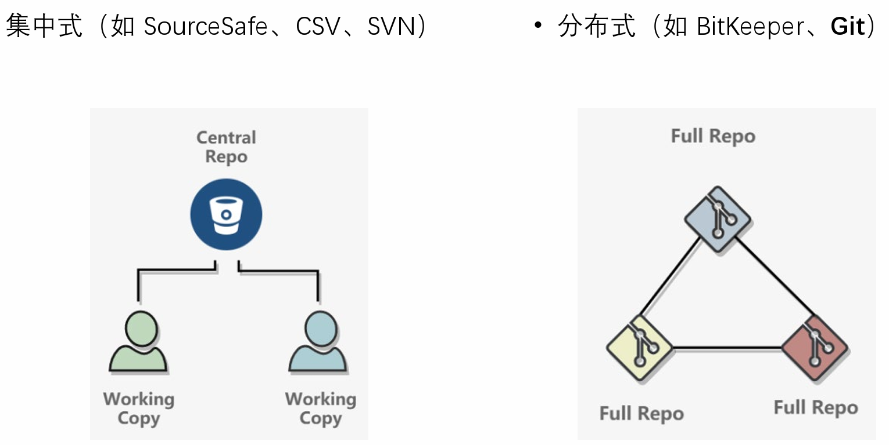

# “Linux 生物信息技术基础”总结报告 8

> 组：G04<br/>次：8<br/>组长：高大可<br/>讨论记录：吴航锐<br/>参与人员：高大可、邓昆月、唐明川、吴航锐<br/>上课时地：2023 年 4 月 17 日，15:10-17:00，35 楼 B107A<br/>讨论时地：2023 年 4 月 22 日，10:00-12:00，35 楼 B104

# 上课内容

## Git 与 Github 简介

> Git：一个用于用于版本控制的软件<br/>Github：运营的网站，协作式源代码托管网站

版本管理：集中式（需要服务器/网络）、分布式



### git 基本概念及命令操作


> 参考资料：[图解 git](http://marklodato.github.io/visual-git-guide/index-zh-cn.html)

### 优势：多人协作

场景：一个软件的版本在 master 上，版本间如果需要进行开发或 debug，可以分出不同的分支，让不同团队去做，最终合并分支即可完成版本更迭。


使用 git 的每日工作基本流程：


### Git 操作演示

```powershell
## 版本控制的基本操作
#首先需要在工作文件夹下初始化git，生成本地git仓库
git init
#查看git状态：是否有未提交的文件和处在缓存状态下的文件
git status
#提交该文件夹下的所有文件进入缓存状态
git add .
#提交该文件夹下的某个文件
git add <the file>
#将缓存状态下的所有文件提交到本地git仓库
git commit
#输入此次提交的说明信息
git commit -m "message for the upload"
#查看提交的历史记录
git log
```

### Github

基于 git 的开源代码托管网站

可以对代码、文档或其他<strong>文字创作内容</strong>进行版本管理和发布，对应的操作有：<strong>创建、下载、修改、提交</strong>

同时，在 github 可以很方便地与他人协作，相应的功能有：

> Issue：写出项目的 bug 等，发起话题供大家讨论<br/>Pull Request & Merge：远程协作，将自己的代码整合到项目中<br/>Comment：对代码等提出评论<br/>Code Review：

其他功能：

Follow：对项目、开发者、组织等进行关注和跟进

Star：“收藏”功能

<strong>生信领域的应用</strong>

开源工具代码分享与发布

分析过程的记录和展示（R、Markdown、JupyterNotebook 等）

### 基于 GitHub Pages 创建个人网站

> 网址：< 用户名 >.github.io

内容更丰富、及时更新的个人简历

日常学习、总结记录及分享

开源社群的积极参与和做出贡献

个人品牌的长期积累

# <strong>讨论主题</strong>

1. github 常见功能和使用方法

- Github 的工作

1. 实例学习 git 与 github 交互

# 讨论内容

实例学习 git 与 github 交互

1. 安装 git
2. 配置本地 Git（设置用户名和邮箱）

```powershell
git config --global user.email "you@example.com"
git config --global user.name "Your Name"
```

1. 使用令牌登录

> 参考文章：[https://zhuanlan.zhihu.com/p/401978754](https://zhuanlan.zhihu.com/p/401978754)


```powershell
git remote set-url origin https://<your_token>@github.com/<USERNAME>/<REPO>.git
```

1. 注册 github 账号并且建立仓库（主页-repository-new）


得到仓库地址：[https://github.com/dkyyyyyyyyyyy/dkys-repository.git](https://github.com/dkyyyyyyyyyyy/dkys-repository.git)

1. 在本地随便新建一个测试文件夹，并且建立与指定远程仓库相同步的本地仓库

```powershell
touch 1234.txt
git clone https://github.com/dkyyyyyyyyyyy/dkys-repository.git
```

1. 暂存并提交代码

```powershell
git add * 
git commit -m 'messages' 
git branch -M main
git push origin main（本地）:main（远程）
```

1. Vs code 会自动连接到 github 询问授权信息，点击同意即可
2. 传输完成


若是其他人上传到你底下的仓库，会收到邮件，最后在网页上同意 pull request 即可


### <strong>Assignment to train git use</strong>

1. Create a new repository on GitHub
2. Clone the repository to your local machine.
3. Create a new branch called “feature"
4. Create a new file called “README.md and add some text to it.
5. Add the file to the staging area.
6. Commit the changes with a message
7. Push the changes to the remote repository.
8. Merge the feature branch into the main branch.

# 存在问题

1. 使用 token 进行传输时，push 的在线文件和本地文件有所不同

token 上传后会直接修改密码，没有 pull request，使用时需要非常谨慎。


