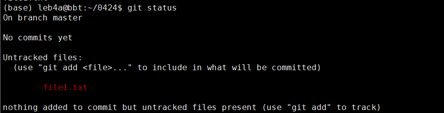
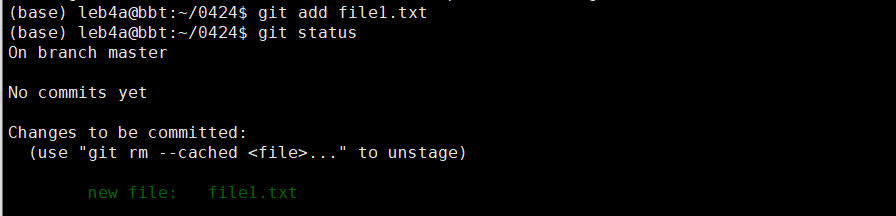
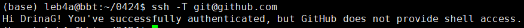
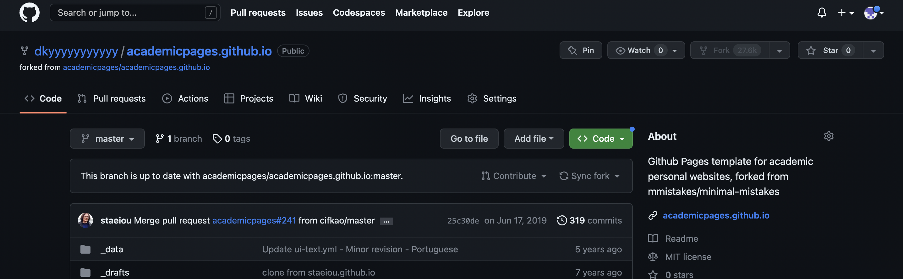
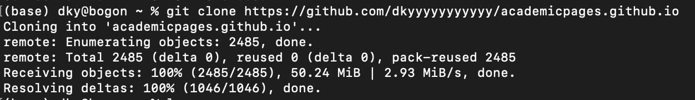
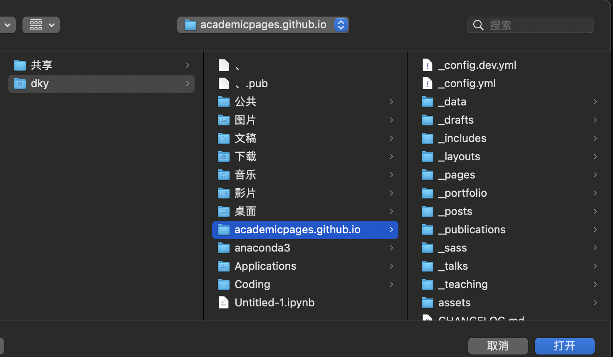
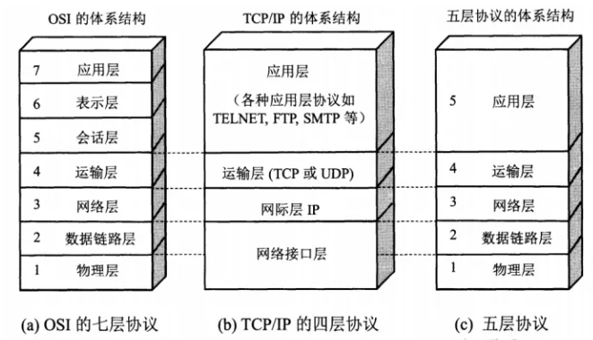
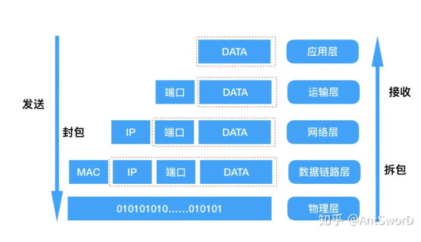
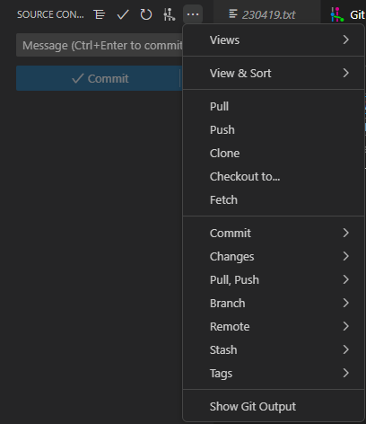
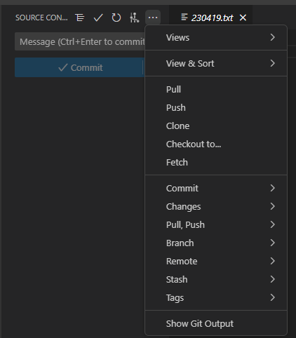

# “Linux 生物信息技术基础”总结报告 9

> 组：G04<br/>次：9<br/>组长：高大可<br/>讨论记录：高大可<br/>参与人员：高大可、邓昆月、唐明川、吴航锐<br/>上课时地：2023 年 4 月 24 日，15:10-17:00，35 楼 B107A<br/>讨论时地：2023 年 4 月 29 日，10:00-12:00，35 楼 B104

# 上课内容

## 如何在终端上使用 git

- 安装 git -- linux 发行版一般默认安装
- 配置

  - 仅仅作为身份识别信息
  - 在 ~/.gitconfig 中添加身份信息
  - global 参数 表示该身份可用于将来的所有项目
- 初始化仓库

  - .git 目录下是 git 行使功能所需要的文件

```powershell
git init
# initialized empty Git repository in current dire
```

- 状态

  - 查看当前工作目录状态

```powershell
git status
```



- 打包放到暂存区

```powershell
git add file1.txt
```



- 将暂存区的“货物”取出（源文件不会删除）
- 将暂存区的“货物”上交

```powershell
git commit -m 'add file1'
```


不加"-m"，会进入文本编辑器，强制要求输入相关的信息

一般会写干了什么事情，如“加了新的文件”

提交后暂存区没有“货物”


- 链接到 github

  - 本地运行 ssh-keygen，token 公钥、私钥


- id_rsa:私钥，权限较高
- id_rsa.pub：公钥，可以给别人。将公钥提供给 git_hub

```powershell
ssh -T git@github.com
#检测是否连接成功
```



```powershell
git remote add origin git@github.com:???/???.git
#  origin: 在本地用什么称呼这个远程仓库

git remote -v
# 查看该目录与哪些远程仓库建立连接
```

尽量避免远程仓库和本地不同步

master:main

> 小故事：由于 master 涉及政治正确问题，现主程序分支名一般都为 main

本地分支名字:本地仓库名

```bash
git push origin master:main
# 将本地仓库的master分支上传到远程仓库的main分支

git branch -u origin:main
# 预设上传的远程的分支，会在gitconfig里出现新的配置信息
```

## 如何在 git hub 上下载代码？

（1）Fork 目标代码（fork 在右上角）


（2）目标代码就会被存进自己的仓库



（3）在本地下使用 git clone 指令下载文件

（似乎 mac，windows 系统自带 git 命令）



（4）代码文件就被下载好了



# <strong>1</strong><strong>讨论主题</strong>

1. 如何增加 `git push` 稳定性
2. 如何在 git hub 上下载代码？
3. VS code——source control

# 讨论内容

## 如何增加 `git push` 稳定性

clash 监控 127.0.0.1 的 7890 端口，从该端口发出的信息会根据设置的情况是否走代理

规则：在 clash 的 profile 中可以设置

网络端口：固定类型的信息走一定的端口

代理：打上标签就不会被拒绝

和网站交互的过程：





网络代理工作原理：

Step 1：客户端与代理服务器之间进行连接。用户配置代理服务器和递质端口后，发起网络请求时，请求会经过代理服务器进行转发。代理收到请求后，会根据预设的策略判断是否允许流程继续向目标服务器传输（如满足某个格式的网址）。如果继续传输，进行 Step 2 的流程；

Step 2：代理服务器与目标服务器之间进行通信。代理服务器奖用户发出的请求转发到目标服务器，目标服务器返回响应内容后，代理奖响应内容发给用户。整个过程中代理通过自己的 IP 和位置信息代替用户发出请求，从而隐藏用户的真实信息。

在本地的 git 中，通过 power shell 添加设置：

```powershell
git config --global http.proxy http://127.0.0.1:7890
```

## 可以在本地配置 git，在本地配置 clash



使用 Visual Studio Code 中的可直接访问 git

电脑本地未特意配置过 git，可能在安装 Visual Studio 或 Visual Studio Code 时附带安装？

## Source-control 本地使用 VS code

vscode 自带 Source control 功能，可以在此进行 commit、push 等行为。特别的是，如果需要对其他项目进行协作，vscode 能自动完成创建 fork（为用户创建一个原文件的复制）和<strong>pull and push</strong>（将本地和云端仓库同步）的工作，省去很多麻烦。

<strong>如果用命令行创建 fork，需要安装 GitHub </strong><strong>CLI</strong><strong> tool</strong>

1. Create a folder for your project on your local hard drive.
2. Change into this folder.
3. Initialize a new, empty Git repository here.
4. Add all changes to the next (= first) commit.
5. Create this first commit.
6. Create a repository on GitHub.
7. [Push your local repository to the remote repository on GitHub](https://docs.github.com/en/migrations/importing-source-code/using-the-command-line-to-import-source-code/adding-locally-hosted-code-to-github)



# 存在问题
